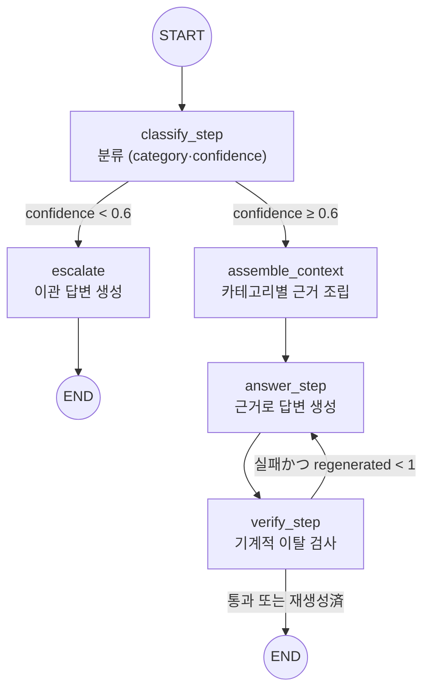

# questail-collie REPORT

## (1) 주제와 근거 문서

게임 라이브러리 라우팅 에이전트. 흩어진 게임 이력을 md로 아카이빙하는 QuestTail의 저장소를 질의 대상으로 삼았다. 게임은 플레이타임·업적률·장르·별점·기피 사유처럼 출처와 성격이 다른 데이터 축이 한곳에 모여 있어, "근거의 출처 계층으로 카테고리를 가르는" 라우팅 설계의 재료가 된다. 일반 상식(LLM 내부 지식)으로 답하기 쉽고 근거 확인이 어려운 질문(내 별점·내 플레이타임)이 천연으로 나와, 근거 이탈 검증을 걸기 좋다.

근거 문서 6종:

| ID | 문서 | 성격 | 출처 |
|---|---|---|---|
| D-A | `data/mock/library.md` | 객관 정본 인덱스(appid·이름·플레이타임·최근플레이·장르·업적률) | 합성 목데이터 (형식은 core 출력과 동일) |
| D-B | `data/mock/games/*.md` 171개 | 객관은 파생, 주관(rating·status·dislikeReasons)은 정본 | 합성 목데이터 |
| D-C | `data/mock/taste-profile.json` | 계산 산출물(topGenres 가중치·플레이타임 5수요약·wishlistAppIds) | 합성 입력으로 계산한 값 |
| D-D | `docs/policy-collection.md` | 수집 정책 산문 (auto/manual·병합 규칙·업적 제약) | PRD·TODO 결정을 산문으로 옮김 |
| D-E | `docs/policy-rating.md` | 별점·상태 기준 산문 | PRD·TODO 결정을 산문으로 옮김 |
| D-F | `docs/glossary-genre.md` | 장르 택소노미·계산 정의 산문 | PRD 취향 프로필 알고리즘을 옮김 |

D-D~D-F는 새로 발명한 규정이 아니라 PRD·TODO에 이미 결정으로 박혀 있던 내용을 옮긴 것이다. 근거 없는 조항(상태 최종 단계 수·기피 집계 방식 등)은 미확정으로 표기했다.

## (2) 카테고리 설계

5개 목록과 분류 근거. 분류 근거는 **근거의 출처 계층이 다르다** — 객관 데이터 / 계산 산출물 / 주관 정본 / 정책 산문 / 근거 없음.

| 카테고리 | 다루는 문의 | 연결 문서 | 기대 도구 |
|---|---|---|---|
| HISTORY | 보유 여부·플레이타임·마지막 플레이·업적률 | D-A (+D-B 객관) | `lookup_library` |
| TASTE | 상위 장르·플레이타임 분포·위시 경향 | D-C + D-F | `get_taste_profile` + `search_docs` |
| SUBJECTIVE | 내가 준 별점·상태·기피 사유 | D-B 주관 + D-E | `get_game_note` + `search_docs` |
| DATA_OPS | 왜 이 값이 비었나·언제 갱신됐나·자동/수기 구분 | D-D (+`history.jsonl`) | `search_docs` |
| OUT_OF_SCOPE | 공략·시세·미보유 게임 평가·PSN/Xbox | 없음 → 이첩 | `escalate` |

`docs/_mapping.md` 매핑표:

| 청크 id | 제목(##) | 카테고리 |
|---|---|---|
| D-D#데이터-계층 | policy-collection 1. 데이터 계층 | DATA_OPS |
| D-D#재동기화-병합 | policy-collection 2. 재동기화 병합 규칙 | DATA_OPS |
| D-D#저장소-배치 | policy-collection 3. 저장소 배치 | DATA_OPS, HISTORY |
| D-D#스냅샷-로그 | policy-collection 4. 스냅샷 로그 | DATA_OPS |
| D-D#업적-제약 | policy-collection 5. 업적 데이터 수집 제약 | HISTORY, DATA_OPS |
| D-D#수집-범위 | policy-collection 6. 수집 범위 | DATA_OPS |
| D-E#별점-척도 | policy-rating 1. 별점 척도 | SUBJECTIVE |
| D-E#별점-미입력 | policy-rating 2. 별점 미입력의 취급 | SUBJECTIVE |
| D-E#상태-분류 | policy-rating 3. 상태 분류 | SUBJECTIVE |
| D-E#기피-사유 | policy-rating 4. 기피 사유 표기 | SUBJECTIVE |
| D-E#입력-계층 | policy-rating 5. 입력 계층 | SUBJECTIVE, DATA_OPS |
| D-F#장르-출처 | glossary-genre 1. 장르 태그 출처 | TASTE |
| D-F#플레이타임-분배 | glossary-genre 2. 멀티 장르 플레이타임 분배 | TASTE |
| D-F#정규화 | glossary-genre 3. 정규화 | TASTE |
| D-F#topgenres-주의 | glossary-genre 4. topGenres 주의 | TASTE |
| D-F#미반영-신호 | glossary-genre 5. 미반영 신호 | TASTE, SUBJECTIVE |

OUT_OF_SCOPE에 연결된 청크가 하나도 없다. 이는 정상이다 — 범위 밖 문의는 근거를 인용하지 않고 이첩하는 것이 정답이므로 근거가 없다.

## (3) 평가셋 설계

> TODO(평가셋 확정 후)

## (4) 측정 결과

> TODO(측정 후)

## (5) 파이프라인 구조도

`src/graph.ts` 그대로. 노드명은 상태 채널명(`classify`·`answer`·`verify`)과 충돌하지 않게 `_step` 접미를 쓴다(충돌 시 LangGraph가 런타임에 거부한다 — (7) 회고 참고).

분기 2곳, 둘 다 조건 분기다. 재생성 루프는 상한 1회이며, 상한을 넘긴 실패는 실패 기록을 유지한 채 종료한다(감추지 않는다).

## (6) 데모 설계

화면(`public/index.html`, 의존성 없는 단일 HTML)은 과제 필수 요구(답변과 함께 호출한 도구·근거 스니펫·검증 결과 노출)를 4개 섹션 분리로 만족한다. 분리 이유:

- (1) 답변 — 사람이 읽는 결과물. 이것만 보면 되는 독자와, 아래를 대조하는 독자를 나눈다.
- (2) 호출한 도구(`toolsUsed`) — 실제로 어떤 도구를 탔는지 공개한다. "도구 호출 적절성" 지표를 사람이 눈으로 확인할 수 있는 자리다.
- (3) 근거(`evidenceIds`와 텍스트) — 답변이 근거에 있는지 대조하는 감사 자리다. id만으로는 대조가 안 되므로 텍스트를 함께 싣는다.
- (4) 검증(`verify.passed`·`violations`) — 기계적 이탈 검사의 판정을 숨기지 않는다. 실패해도 실패로 보여준다.
- 분류 결과(`category`)·`confidence`·이관 여부(`escalated`)는 상단 메타 한 줄로 둔다. 분류와 이관 판단이 분리돼 있다는 설계가 화면에서 그대로 보인다.

> TODO(캡처 후)

## (7) 프로젝트 회고

- **그래프 프레임워크의 실패는 타입 시스템 바깥에 있다.** LangGraph는 노드명과 상태 채널명이 같으면 런타임에 거부한다. `typecheck`은 통과하고 스모크에서야 드러났다(그래프 워커가 실제로 겪음. `src/graph.ts`에 `classify_step`·`answer_step`·`verify_step`命名과 충돌 경위 주석으로 남아 있다). 타입이 잡아주는 세계와 프레임워크가 거부하는 세계가 다르다는 것을, 문서가 아니라 실패로 확인했다.
- **문서와 데이터의 불일치는 검수에서 잡혔다.** 근거 산문에 "주관 데이터는 비어 있는 것이 정상"이라고 단정해 두었는데, 목데이터에는 별점이 30건 들어가 있었다. 문구 하나가 에이전트의 오답을 정당화할 뻔했다. 근거 문서는 데이터 실측과 대조해 검수해야 한다.
- **의존성 조립 실패는 기동 실패가 아니다.** `data/mock`이 아직 없던 시기에 `getDeps()` 지연 로딩으로 두어, import 시점이 아니라 사용 시점에 "데이터 미생성" 메시지로 실패하게 했다. 병렬 워커 체제에서는 남의 산출물을 기다리는 동안 내 서버가 죽지 않는 편이 낫다.
