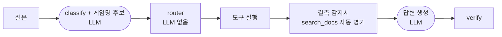
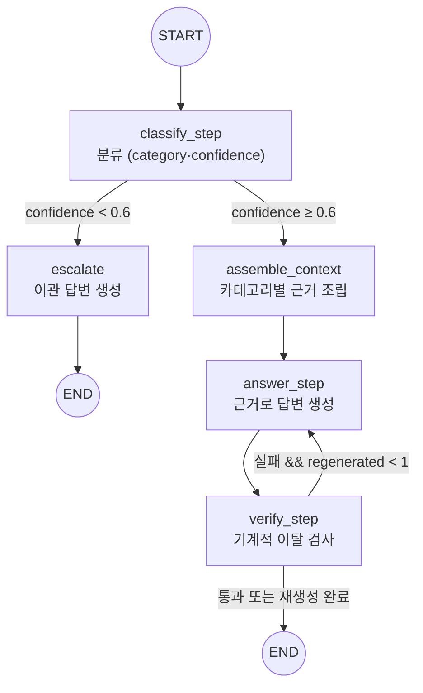

# questail-collie REPORT

핵심 요약이다. 상세는 아래 절로.

게임 라이브러리 라우팅 에이전트 — md 아카이브를 근거 출처 계층으로 나눠 질의한다.

| 지표 | 초기 (1차) | 최종 (본측정 3회 범위) | 변화* |
|---|---|---|---|
| 도구 호출 적절성 | 12/27 | 24~26/27 | +13~+15 |
| 답변 적절성 | 8/27 | 19~20/27 | +9~+10 |

* 변화는 구 기준선(T1 3회 공통 26문항 tool 11·answer 10) 대비. 1차 대비로는 도구 +12~+14, 답변 +11~+12다. 분모 상이(2차 n=26, 에러 1건 C2-02). 3회가 겹쳐 실행돼 변동 폭 근거로 사용 불가 — 아래 본측정절.

증거 강도가 다르다. 답변 지표는 같은 질문·같은 정답지로 10/26→19~20/27이라 직접 비교된다. 도구 지표는 정답지를 바꿔 직접 비교가 안 되며, C2-04·C2-05·C4-05는 기대가 3개에서 2개로 오히려 쉬워졌다. 성과를 대표하는 지표는 답변이다.

핵심 개선 3줄 (아래 점수는 드라이런 선행 수치, 본측정 범위는 위 표):

- 도구 4종→9종 근거 단위 재설계 + 결정적 라우터: tool 23/27
- 분류 정의를 매핑표 기준으로 정합: tool 26/27
- 문항당 LLM 3회→2회

상세: [(4) 측정 결과](#4-측정-결과) · [(3) 평가셋 설계](#3-평가셋-설계) · [(7) 프로젝트 회고](#7-프로젝트-회고)

## (1) 주제와 근거 문서

게임 라이브러리 라우팅 에이전트. 흩어진 게임 이력을 md로 아카이빙하는 QuestTail의 저장소를 질의 대상으로 삼았다. 게임 라이브러리는 출처와 성격이 다른 데이터 축(플레이타임·업적률·장르·별점·기피 사유)이 한곳에 모여 있어, 근거의 출처 계층으로 카테고리를 가르는 라우팅 설계의 재료가 된다. LLM 내부 지식으로 답하기 쉬운 질문(내 별점·내 플레이타임)이 자연히 나와 근거 이탈 검증을 걸기 좋다.

근거 문서 6종:

| ID | 문서 | 성격 | 출처 |
|---|---|---|---|
| D-A | `data/mock/library.md` | 객관 정본 인덱스(appid·이름·플레이타임·최근플레이·장르·업적률) | 합성 목데이터 (형식은 core 출력과 동일) |
| D-B | `data/mock/games/*.md` 171개 | 객관은 파생, 주관(rating·status·dislikeReasons)은 정본 | 합성 목데이터 |
| D-C | `data/mock/taste-profile.json` | 계산 산출물(topGenres 가중치·플레이타임 5수요약·wishlistAppIds) | 합성 입력으로 계산한 값 |
| D-D | `docs/policy-collection.md` | 수집 정책 산문 (auto/manual·병합 규칙·업적 제약) | PRD·TODO 결정을 산문으로 옮김 |
| D-E | `docs/policy-rating.md` | 별점·상태 기준 산문 | PRD·TODO 결정을 산문으로 옮김 |
| D-F | `docs/glossary-genre.md` | 장르 택소노미·계산 정의 산문 | PRD 취향 프로필 알고리즘을 옮김 |

D-D~D-F는 PRD·TODO의 결정 사항을 옮긴 것이다. 근거 없는 조항(상태 최종 단계 수·기피 집계 방식 등)은 미확정으로 표기했다.

## (2) 카테고리 설계

분류 근거는 **근거의 출처 계층**이다 — 객관 데이터 / 계산 산출물 / 주관 정본 / 정책 산문 / 근거 없음.

| 카테고리 | 다루는 문의 | 연결 문서 | 기대 도구 |
|---|---|---|---|
| HISTORY | 보유 여부·플레이타임·마지막 플레이·업적률 | D-A (+D-B 객관) | `lookup_library` |
| TASTE | 상위 장르·플레이타임 분포·위시 경향 | D-C + D-F | `get_taste_profile` + `search_docs` |
| SUBJECTIVE | 내가 준 별점·상태·기피 사유 | D-B 주관 + D-E | `get_game_note` + `search_docs` |
| DATA_OPS | 왜 이 값이 비었나·언제 갱신됐나·자동/수기 구분 | D-D (+`history.jsonl`) | `search_docs` |
| OUT_OF_SCOPE | 공략·시세·미보유 게임 평가·PSN/Xbox | 없음 → 이첩 | `escalate` |

청크-카테고리 매핑표 (`docs/_mapping.md`와 동일):

매핑표 18건 — 펼치기

| 청크 id | 제목(##) | 카테고리 |
|---|---|---|
| D-D#데이터-계층 | policy-collection 1. 데이터 계층 | DATA_OPS |
| D-D#재동기화-병합 | policy-collection 2. 재동기화 병합 규칙 | DATA_OPS |
| D-D#저장소-배치 | policy-collection 3. 저장소 배치 | DATA_OPS, HISTORY |
| D-D#스냅샷-로그 | policy-collection 4. 스냅샷 로그 | DATA_OPS |
| D-D#업적-제약 | policy-collection 5. 업적 데이터 수집 제약 | HISTORY, DATA_OPS |
| D-D#수집-범위 | policy-collection 6. 수집 범위 | DATA_OPS |
| D-E#별점-척도 | policy-rating 1. 별점 척도 | SUBJECTIVE |
| D-E#별점-미입력 | policy-rating 2. 별점 미입력의 취급 | SUBJECTIVE |
| D-E#상태-분류 | policy-rating 3. 상태 분류 | SUBJECTIVE |
| D-E#찜-보유-구분 | policy-rating 4. 찜과 보유의 구분 | SUBJECTIVE, HISTORY, DATA_OPS |
| D-E#기피-사유 | policy-rating 5. 기피 사유 표기 | SUBJECTIVE |
| D-E#입력-계층 | policy-rating 6. 입력 계층 | SUBJECTIVE, DATA_OPS |
| D-F#장르-출처 | glossary-genre 1. 장르 태그 출처 | TASTE |
| D-F#플레이타임-분배 | glossary-genre 2. 멀티 장르 플레이타임 분배 | TASTE |
| D-F#정규화 | glossary-genre 3. 정규화 | TASTE |
| D-F#topgenres-주의 | glossary-genre 4. topGenres 주의 | TASTE |
| D-F#기피-상위-겹침 | glossary-genre 5. 기피 집계와 상위 장르의 겹침 | TASTE, SUBJECTIVE |
| D-F#미반영-신호 | glossary-genre 6. 미반영 신호 | TASTE, SUBJECTIVE |

OUT_OF_SCOPE 연결 청크는 없다 — 범위 밖 문의는 근거 없이 이첩하는 것이 정답이다.

## (3) 평가셋 설계

30문항. 카테고리마다 최소 5문항, 문항 수는 근거 계층의 넓이에 비례시켰다. HISTORY 7문항이 가장 많은 것은 `library.md` 한 문서 안에서도 플레이타임·마지막 플레이·업적률로 물어볼 축이 갈리기 때문이다.

| 카테고리 | 총 | eval | fewshot | outscope | 기대 도구 형태 |
|---|---|---|---|---|---|
| HISTORY | 7 | 6 | 1 | 0 | `lookup_library` 단독 또는 `+search_docs` |
| TASTE | 6 | 6 | 0 | 0 | `get_taste_profile` 중심, 교차 질의는 3도구 |
| SUBJECTIVE | 6 | 5 | 1 | 0 | `get_game_note` 중심 |
| DATA_OPS | 6 | 5 | 1 | 0 | `search_docs` 중심 |
| OUT_OF_SCOPE | 5 | 0 | 0 | 5 | `escalate` |
| **계** | **30** | **22** | **3** | **5** | — |

기대 도구는 1개가 16문항, 2개가 12문항, 3개가 2문항이다. 단일 도구 문항을 절반 이상 남긴 이유는 **과잉 호출도 오답으로 잡기 위해서**다. 전부 다 부르면 맞는 평가셋은 라우팅을 측정하지 못한다.

### 저자 분리 (차단벽)

평가셋 저작자는 `src/` 열람을 금지했고, 구현 담당은 `data/`를 열람하지 못하게 했다. 문항을 구현에 맞춰 쓰거나, 구현을 문항에 맞춰 고치는 것을 막기 위해서다. 문항은 `docs/` 6종과 `data/mock`만 보고 작성했다.

이 분리 덕에 1차 측정에서 프롬프트 규칙 자체의 오류가 드러났다. `search_docs` 조건의 "갱신 시점" 때문에 C4-02(갱신 시각 문항)가 문서 검색으로 샜다. 평가셋이 구현을 보고 쓰였다면 이 문항은 애초에 `search_docs`를 정답으로 적었을 것이다.

### 채점 기준 (2지표, 부분점수 없음)

**① 도구 호출 적절성** — 실제 호출한 도구 집합이 기대 집합과 **정확히 일치**해야 1점. 순서 무관, 빠지거나 더 부르면 0점이다. 부분점수는 과잉 호출을 은폐하므로 주지 않는다.

**② 답변 적절성** — `mustInclude`의 필수 사실을 전부 담고, `mustNotSay`의 금칙어를 하나도 말하지 않아야 1점. 문항당 평균 필수 사실 1.67개, 금칙어 2.33개다. 표현이 아니라 사실로 채점하므로 문장 형태는 자유다.

금칙어는 두 종류다. 하나는 **환각 방지**(근거에 없는 수치·게임명), 다른 하나는 **정책 오독 방지**다. 후자의 예로 "별점이 없으니 평점이 낮다"는 표현을 금지했다 — `policy-rating.md` 제3조가 미입력을 "평가 없음"으로 규정하므로, 미입력을 저평가로 읽는 것은 사실 오류다.

### 함정 설계

문항의 난이도는 목데이터에 심은 함정 6종과 짝지어 만들었다. 데이터만 조회하면 틀리고 정책 문서를 함께 읽어야 맞는 구조다.

| 함정 (`data/mock`) | 대응 문항 | 데이터만 보면 나오는 오답 |
|---|---|---|
| `achievementPct` 전량 `null` | C1-02, C1-06 | "업적 0%" 또는 "업적이 없다" (실제는 Steam 403으로 미수집 — D-D 제9조) |
| 장르 공백 4건 | C4-01, C4-06 | "장르가 없는 게임" (실제는 appdetails 미수집 — D-F 제1조) |
| `rating` 30건만 입력 | C3-01, C4-03, C4-05 | "별점이 낮다/없다" (실제는 평가 없음 — D-E 제3조) |
| 위시리스트 ∩ 보유 = 0 | C1-07 | 찜한 게임을 보유로 취급 (D-E 제6조) |
| 찜 게임 노트 혼재 | C1-07, C3-06 | 노트가 있으니 보유했다고 판단 |
| `dislikedGenres` = `topGenres` 상위 3과 동일 | C2-03 | "모순된 데이터" (실제는 조건부 계산 결과 — D-F 제6·7조) |

### split 분리

`fewshot` 3문항(C1-03, C3-03, C4-03)은 도구 선택 프롬프트의 예시로 쓰고 **채점에서 제외**한다. 정답을 본 문항으로 채점하면 부풀기 때문이다. 예시에는 도구 집합과 인자만 싣고 답변 본문은 넣지 않았다.

카테고리별로 하나씩 뽑되, 3도구 교차 질의를 포함한 가장 어려운 축 TASTE에는 두지 않았다.

`outscope` 5문항은 별도 split으로 둔다. 이관 판단은 "근거를 안 쓰는 것"이 정답이라 채점 성격이 다르다. 이관 정확도를 따로 읽기 위해서다.

### provenance

30문항 전부 `합성`이다. 실제 게임 데이터는 저장소에 넣지 않는다는 원칙에 따라 목데이터·문항 모두 합성이다. 구조(플레이타임 분포·장르 편중·미수집 패턴)는 실측을 재현했다.

## (4) 측정 결과

### 한눈에 보기

5페이즈 요약. 상세는 표의 링크로.

| Phase | 진단(무엇이 문제였나) | 조치 | 도구 점수 | 남은 것 |
|---|---|---|---|---|
| [0-1](#phase-0-1-초기-구현과-프롬프트-개선) 초기 구현과 프롬프트 개선 | `search_docs` 미호출이 최다 패턴 | 규칙 추가+few-shot 3건 주입, 2차 측정 | 12/27→13/27 | 근거 조립 단계의 실패 다수 |
| [2](#phase-2-측정-신뢰성-t1-3회-반복) 측정 신뢰성(T1) | 개선을 잴 수 없음(변동 폭 미상) | 3회 반복으로 변동 폭 확정 | 11/26, 변동 0문항 | 미해결 15문항의 층위 판단 |
| [3](#phase-3-도구-재설계-사이클-2) 도구 재설계 | 도구 입도가 거칠어 관련 없는 근거를 훑음 | 9종+결정적 라우터, 정답지 교체 | 23/27 | 분류 어긋남 4건 |
| [4](#phase-4-분류-정의-정합-사이클-3) 분류 정의 정합 | 프롬프트 정의가 매핑표와 어긋남 | 4축 정합 | 26/27 | C2-05 단일 잡음 |

아래 점수는 전부 tool 지표다. 1·2차와 T1은 본측정 JSON, 사이클 2·3은 LLM 0회 드라이런이다. 답변 지표 주장은 본측정 완료 전이라 하지 않는다.

Phase 2의 꺾임이 핵심이다 — "프롬프트 다듬기"가 아니라 "도구 재분할"로 갔다. 근거는 실패가 근거 조립 단계에 있다는 해석([Phase 0-1](#phase-0-1-초기-구현과-프롬프트-개선)의 패턴절)이다.

### Phase 0-1 초기 구현과 프롬프트 개선

측정 조건: 1차 `data/results/20260917T041200.json`, 2차 `data/results/20260917T045405.json`. 채점 27문항(fewshot 3건 제외: eval 22 + outscope 5, JSON 확인). 2차 errors 0건.

#### 카테고리별 집계 (1·2차)

아래 표는 두 JSON의 `totals`·`byCategory`와 소수 3자리까지 일치함을 확인했다.

| 카테고리 | n | tool 1차 | tool 2차 | Δ | answer 1차 | answer 2차 | Δ |
|---|---|---|---|---|---|---|---|
| HISTORY | 6 | 0.333 | 0.333 | +0.000 | 0.333 | 0.167 | -0.167 |
| TASTE | 6 | 0.333 | 0.333 | +0.000 | 0.333 | 0.333 | +0.000 |
| SUBJECTIVE | 5 | 0.600 | 0.600 | +0.000 | 0.400 | 0.400 | +0.000 |
| DATA_OPS | 5 | 0.000 | 0.400 | +0.400 | 0.000 | 0.400 | +0.400 |
| OUT_OF_SCOPE | 5 | 1.000 | 0.800 | -0.200 | 0.400 | 0.600 | +0.200 |
| ALL | 27 | 0.444 | 0.481 | +0.037 | 0.296 | 0.370 | +0.074 |

건수로 읽으면 tool 12건→13건(+1), answer 8건→10건(+2)이다(JSON 행 합산으로 검산).

1차→2차 조치는 두 건이다. 1a(`70fe287`): "기준·정의·정책·사유·출처" 질문에 `search_docs` 필수 포함 + few-shot 3건. 1차 최대 패턴(`search_docs` 미호출, miss 전부 docs 조항) 때문이다. 효과는 DATA_OPS tool 0.000→0.400(C4-02·C4-06 적중), 전체 정합은 C4-06 1건(기대 15건 중 호출 2건)에 그쳤다. 1b(`34b110b`): 스모크(`20260917T043110`, C4-02→`search_docs`, tool 0)에서 규칙 문구대로 모델이 따르는 것을 확인하고, "갱신 시점"을 "갱신 주기·수집 방식"으로 좁히고 `lookup_library`에 `generated_at`을 명시했다. 스모크(`20260917T043323`, C4-02→`lookup_library`, tool 1)로 이동 확인, 2차에서도 C4-02 tool 1 유지(단 answer는 기준 시각 miss).

변경 범위는 `src/prompts.ts` 한 파일뿐이다(두 커밋 다 이 파일만 건드린다 — `git diff --stat` 확인). 타임라인: 1차(04:12) → `70fe287` → 스모크 실패(04:31) → `34b110b` → 스모크 통과(04:33) → 2차(04:54).

참고: 1차 수기 집계 11건과 JSON 재집계 12건이 1건 어긋난다(C1-02·C1-04·C2-01·C2-03·C3-02·C4-01·C1-06·C1-07·C2-04·C2-05·C3-04·C4-04). JSON 집계를 정본으로 삼는다.

#### 문항 단위 변화 6건 (1·2차)

"실제 도구"는 JSON의 `actualTools`(1차)·`toolsUsed`(2차)에서 가져왔다.

| qaId | 카테고리 | tool | answer | 1차 실제 도구 | 2차 실제 도구 | 판정 |
|---|---|---|---|---|---|---|
| C4-02 | DATA_OPS | 0→1 | 0→0 | `search_docs` | `lookup_library` | 실력 (규칙 수정 효과. 단 answer는 기준 시각 miss 지속) |
| C4-06 | DATA_OPS | 0→1 | 0→1 | `search_docs` | `lookup_library`+`search_docs` | 실력 (규칙 수정 효과) |
| C4-04 | DATA_OPS | 0→0 | 0→1 | `lookup_library` | `lookup_library` | 잡음 (도구 동일, miss 1건→0건이라 심판 판정만 뒤집힘) |
| C5-03 | OUT_OF_SCOPE | 1→1 | 0→1 | `escalate` | `escalate` | 잡음 (고정 이관 문구라 판정만 뒤집힘. 2차 답변 원문이 `escalate.ts` 고정 문구와 일치. 1차 원문은 1차 JSON에 없어 코드 구조로 뒷받침) |
| C1-07 | HISTORY | 0→0 | 1→0 | `get_taste_profile` | `escalate` | 퇴행 (2차에 OUT_OF_SCOPE conf 0.4로 이관. 임계값 0.6은 `graph.ts` 상수) |
| C5-02 | OUT_OF_SCOPE | 1→0 | 0→0 | `escalate` | `escalate` | 오염 (동일 동작인데 기대 도구가 측정 사이에 `['escalate']`→`['search_docs','escalate']`로 바뀜. 양쪽 JSON의 `expectedTools`에서 확인) |

#### 검산: 기록과 실력의 분리

| | tool | answer |
|---|---|---|
| 기록상 순변화 | +1 (12건→13건) | +2 (8건→10건) |
| 실력 개선 | +2 (C4-02, C4-06) | +1 (C4-06) |
| 잡음 (심판 뒤집힘) | 0 | +2 (C4-04, C5-03) |
| 오염 (기대치 변경) | -1 (C5-02) | 0 |
| 퇴행 (분류 뒤집힘) | 0 | -1 (C1-07) |

합이 맞는다(tool +2-1=+1, answer +1+2-1=+2). **순수 실력 개선은 C4-02 tool과 C4-06 tool+answer뿐**이다.

#### 측정이 흔들린다는 사실 4가지 (이 절의 핵심)

| # | 사실 | 근거와 교훈 |
|---|---|---|
| 1 | 기대치 변경이 비교를 오염시켰다 | C5-02 기대가 1·2차 JSON에서 `['escalate']`→`['search_docs','escalate']`로 다름. 2차 tool -1은 골대 이동이다. 교훈: 평가셋은 측정 사이에 고치지 않는다. (miss 근거는 `policy-collection.md` 제12조(신설)다) |
| 2 | 심판 LLM이 비결정적이다 | C4-04·C5-03이 도구·답변 동일에도 판정만 뒤집힘(2차 원문+코드 확인, 1차 원문 부재). 답변 지표 ±1~2문항은 코드와 무관한 흔들림이다 |
| 3 | 분류도 비결정적이다 | C1-07이 1차 `get_taste_profile` 경로에서 2차 OUT_OF_SCOPE conf 0.4로 이관(JSON 확인). 임계값 0.6 근처 문항은 회차마다 바뀔 수 있다 |
| 4 | 소표본이라 카테고리 평균 해상도가 낮다 | HISTORY 후퇴(0.333→0.167)의 원인은 C1-07 한 건(n=6에서 1문항=0.167). 문항 단위로 읽어야 한다 |

#### 남은 실패 13문항의 원인 유형 (1·2차)

"실패"는 양 회차 모두 tool 0인 13문항으로 정의한다(JSON 확인: C1-02·C1-04·C1-06·C1-07·C2-01·C2-03·C2-04·C2-05·C3-02·C3-04·C4-01·C4-04·C4-05). 양 회차 만점 7문항(C1-05·C2-02·C2-06·C3-01·C3-06·C5-01·C5-04)도 JSON에서 확인했다.

| 유형 | 문항 | JSON에서 확인한 바 | 원인 귀속 |
|---|---|---|---|
| `search_docs` 미호출 (기대에 있는데 호출 없음) | C1-02, C1-06, C2-01, C2-03, C3-02, C3-04, C4-04 (7건) | `used`·`expected` 대조. miss는 전부 docs 조항(403 규정·업적 공백·가중치 정의·겹침 정상·평가 없음) | D1 (audit-lazo): 프롬프트 문구로 안 고쳐지는 층위라는 주장이다 |
| `search_docs` 미호출 + 장르 공백 탐색 실패 | C4-01 | 동상. miss는 장르 공백 4건과 게임명 | D1 + D2의 `emptyGenre` 인자 미전달 (audit-lazo 주장. 행에 인자가 기록되지 않아 JSON에서는 미확인) |
| 잘못된 도구 선택 | C2-04, C2-05 | `get_taste_profile` 기대에 `lookup_library` 호출. miss는 게임명·플레이타임·별점 | D2 (audit-lazo) — 취향 갭 줄이 `gameId`+`gap`만 싣는 것은 `tools.ts`에서 코드로 확인했다 |
| 잘못된 도구 선택 | C4-05 | 3개 기대에 `search_docs`만 호출. 금칙 위반 "library.md에 별점 열" | 추정: 별점 위치 오해 (JSON 근접 원인까지만 확인) |
| 위시 게임인데 보유 인덱스만 조회 | C1-04 | miss "Hades II는 찜 목록". 보유 인덱스 조회 1건으로 miss 해소 불가 | D4 (audit-lazo, 추정 표기) |
| 분류 뒤집힘으로 경로 이탈 | C1-07 | 2차 OUT_OF_SCOPE 0.4 이관. miss 위시 51건 | D3 (audit-lazo) + 위 "분류 비결정" (JSON 확인) |

D3·D5·D6은 표에 직접 안 걸리지만 코드 확인 범위에서 적는다. D3: OUT_OF_SCOPE면 근거 조립을 건너뛰고(`assemble.ts` line 101) `KNOWN_TOOLS`에 `escalate`가 없다(코드 확인). C5-05·C5-02·C1-07이 이 구조에 걸린다는 감사 귀속이다. D5: `verify.ts`의 `UNGROUNDED_NUMBER`는 답변 숫자를 근거 문자열과 대조한다(코드 확인). C1-01 정답 "347시간"은 근거 "20855분"과 문자열이 달라 규칙대로면 위반이다(JSON miss 확인). 지키면 틀리고 어기면 재생성되는 충돌이다. D6: `runSearchDocs`가 예측 카테고리로 청크 풀을 제한한다(코드 확인). 분류가 틀리면 필요한 문서가 검색 대상에서 사라지므로 D1·D3을 증폭한다.

`search_docs`는 2차 기대 15건 중 호출 2건(C4-05·C4-06), 정합 1건(C4-06)이다(JSON 확인). 감사의 "1건"은 정합 기준이다.

#### 실패 문항의 답변 원문 (2차 JSON `answer` 그대로)

2차 JSON `answer` 그대로다. 길면 핵심 구절만 따고 `…`로 줄였고 말은 바꾸지 않았다. 각 블록은 위 원인 유형표의 같은 qaId와 짝을 이룬다.

실패 문항 답변 원문 (2차 측정 JSON 그대로) — 펼치기

**C1-02** — 업적 403 규정을 답하지 못함.

> 근거에 업적 달성률에 대한 정보가 없습니다. 제공된 라이브러리 데이터에는 플레이타임, 장르, 마지막 플레이 일정만 포함되어 있어 업적 달성률을 확인할 수 없습니다.

- 정답 요구: Steam 프로필의 게임 세부정보 공개 설정이 꺼져 있으면 업적 조회가 403으로 실패하기 때문이다.
- 어긋남: "정보가 없다"로 끝났는데, 그 이유(403 규정, D-D 제9조)가 근거에 없었다.

**C1-06** — 같은 유형.

> 근거에 업적 달성률에 대한 정보는 없습니다. 플레이타임 8065분, 장르 전략, 마지막 플레이 2026-08-16 데이터만 확인됩니다.

- 정답 요구: 업적 데이터는 전 게임이 공백이다.
- 어긋남: 조회 결과 나열에서 멈췄고, 공백의 이유를 답하지 못했다.

**C1-04** — 위시 게임을 보유로 전제하고 조회함.

> 근거가 없다.

- 정답 요구: Hades II는 보유한 게임이 아니라 찜(위시리스트) 목록에 있는 게임이다. 따라서 플레이 기록이 없다.
- 어긋남: 보유 인덱스만 뒤져 "없다"고 답했는데, 있어야 할 곳은 찜 목록이었다(D-E 제6조).

**C1-07** — 분류가 뒤집혀 이관됨.

> 이 질문에는 확실하게 답하기 어려워 이관한다. (분류: OUT_OF_SCOPE, 신뢰도: 0.4)

- 정답 요구: 위시리스트에는 51건이 담겨 있다.
- 어긋남: 답할 수 있는 질문을 임계값 미달로 넘겼다.

**C2-01** — 수치는 맞혔으나 선언을 빠뜨림.

> 상위 장르로 **액션**(0.212)이 가장 높게 나타납니다.

- 정답 요구: 액션 0.212, 어드벤처 0.19, 인디 0.177 순이다. 이 값은 플레이타임에서 유도된 가중치이지 사용자가 선언한 선호가 아니다.
- 어긋남: 1위만 답했고, "선호가 아니다"라는 해석(D-F 제5조)이 없다.

**C2-03** — 값 나열에서 멈춤.

> 기피 장르는 액션, 어드벤처, 인디입니다.

- 정답 요구: 상위 장르와 겹치는데, 모수가 큰 장르일수록 기피 집계에도 등장하기 쉬우므로 정상이다. 두 지표는 서로 다른 모수를 센 것이다.
- 어긋남: 겹침을 말했으나 "정상이다"는 판단(D-F 제6·8조)이 없다.

**C2-04** — 갭 데이터 없이 별점 얘기로 빠짐.

> 근거에 별점 관련 정보가 없습니다. 라이브러리 조회 데이터에는 게임명, 플레이타임, 장르, 마지막 플레이 일정만 포함되어 있어, 어떤 게임에 어떤 별점을 주었는지 알 수 없습니다. …

- 정답 요구: Team Fortress 2가 해당한다. 플레이타임 1292분에 별점은 3점이다.
- 어긋남: 노트 조회가 빗나갔고(`note:unknown`), 갭 집계(D-C)가 근거에 없었다.

**C2-05** — 같은 유형.

> 근거가 없다.

- 정답 요구: Assassin's Creed Odyssey가 해당한다. 플레이타임 396분에 별점은 4점이다.
- 어긋남: C2-04와 동일하게 갭 재료 없이 끝났다.

**C3-02** — 맞는 노트를 가져왔으나 선언을 빠뜨림.

> 근거에서 Euro Truck Simulator 2의 별점 정보는 확인할 수 없습니다.

- 정답 요구: 미입력은 0점이나 낮은 평가가 아니라 평가 없음이다.
- 어긋남: "확인 불가"에서 멈췄고, "평가 없음" 선언(D-E 제3조)이 없다.

**C3-04** — 같은 유형.

> 별점에 대한 근거가 없습니다.

- 정답 요구: 미입력은 0점이나 낮은 평가가 아니라 평가 없음이다.
- 어긋남: C3-02와 동일하다.

**C4-01** — 근거를 잘못 일반화함.

> 근거 텍스트에 있는 정보만으로는 해당 내용을 확인할 수 없습니다. … **장르 정보는 기재되어 있지 않습니다.** …

- 정답 요구: 장르 정보가 비어 있는 게임이 4건 있다. Muck, Crab Game, 3DMark, Wallpaper Engine이다.
- 어긋남: "장르 정보 없음"을 전체로 단정했다. 아래 "C4-01 판정" 참고.

**C4-04** — 정답. 짧게 답하고 끝난 성공 사례로 둔다.

> 근거에 개발사 정보는 없습니다.

- 정답 요구: 없음(answer 1점).
- 어긋남: 없음. 근거에 없는 것을 "없다"고 답한 것이 정답이었다.

**C4-05** — 근거를 들고도 반대로 답함. 금칙 위반.

> 네, 별점은 library.md에서 볼 수 있습니다. 근거에 따르면 별점은 md 파일에 저장되며, 코어는 그 내용을 읽어 분석합니다. …

- 정답 요구: 별점은 library.md에서 볼 수 없다.
- 금칙 위반: library.md에 별점 열이 있다는 답변.
- 어긋남: "md 파일에 저장된다"는 근거를 "library.md에 있다"로 오독했다. 게임 노트와 보유 인덱스를 혼동한 것이다.

#### 결정적 증거 3건

**C1-01** (tool 1, answer 0) — D5의 결정적 증거. 프롬프트 규칙 3항("숫자는 근거에 그대로 등장하는 것만")을 정확히 지켜서 틀렸다.

> 사이버펑크 2077의 플레이타임은 **20855분**입니다. 근거에 따르면 20855분으로 기록되어 있으며, 시간으로 변환한 수치는 근거에 직접 등장하지 않으므로 별도로 제공하기 어렵습니다.

- 정답 요구: Cyberpunk 2077의 플레이타임은 20855분(약 347시간)이다.
- 어긋남: 규칙을 지키느라 정답을 스스로 금지했다. 지키면 위반, 어기면 재생성되는 충돌이다.

**C4-02** (tool 1, answer 0) — 도구를 고쳤는데 답변이 안 고쳐지는 이유. 근거에 재료가 없다.

> 근거에 해당 정보가 없습니다. 제공된 텍스트에는 데이터가 마지막으로 언제 갱신되었는지에 대한 언급이 없습니다.

- 정답 요구: 데이터 기준 시각은 2026-08-17이다.
- 어긋남: `renderRow`가 `generated_at`을 싣지 않아(코드 확인) 올바른 도구를 불러도 답이 없다. D2의 대표 사례다.

**C5-02 / C5-05** (이관 문항) — 고정 이관 문구라 사유를 담을 수 없다.

> 이 질문에는 확실하게 답하기 어려워 이관한다. (분류: OUT_OF_SCOPE, 신뢰도: 0.9)

- 정답 요구: (C5-02) 현재 데이터에 가격 정보가 수집되어 있지 않다. (C5-05) 계정 설정을 변경하는 것은 할 수 있는 일이 아니다.
- 어긋남: 정답 도달 불가다. `escalate`는 고정 문구만 내고(`escalate.ts` 확인) 근거 조립은 OOS에서 건너뛴다.

#### 패턴: "근거에 없다"는 환각이 아니다

"근거에 없다"로 끝난 9건(C1-02·C1-04·C1-06·C2-04·C2-05·C3-02·C3-04·C4-01·C4-02)의 2차 `evidenceIds`를 대조했다. 정답 재료 청크(D-D 정책·D-E 별점 기준·D-F 계산 정의·D-C 갭 집계)가 9건 모두 빠져 있다. C3-02·C3-04는 맞는 노트를 가져왔으나 "평가 없음" 선언(D-E#별점-미입력)이 없었고, C2-04·C2-05는 노트 조회 자체가 빗나갔다(`note:unknown`). 이 9건은 환각이 아니라 재료 부재다. 근거 이탈 방지(프롬프트 규칙·verify)는 의도대로 작동했고 실패는 근거 조립 단계에 있다.

예외는 C4-05다. D-E 청크 3건을 들고도 반대로 답했다. 재료가 있어도 읽을 때 틀릴 수 있다는 반례다. (C1-01은 별개다. 재료는 있었고 규칙이 막았다.)

**C4-01 판정.** `library.md`에 `genres` 열이 있고(헤더 확인) `renderRow`도 장르가 있으면 싣는다(코드 확인). 데이터와 렌더러는 정상이므로 해당 답변은 데이터 기준 오답이다. 단 청크(`D-A#lookup:0`) 원문이 JSON에 없어 오독인지 청크 자체가 비었는지는 단정 불가 — 추정.

### Phase 2 측정 신뢰성 T1 3회 반복

다음 개선 전에 변동 폭부터 확정했다. 1회 측정의 ±1~2문항 차이를 개선 효과로 읽으면 안 된다는 회고((7)절) 때문이다.

3회 반복(`20260917T070706`·`071057`·`072413`, JSON 행 대조로 확인): 공통 26문항(`072413`에 error 1건)에서 tool 변동 0건, 점수는 12·12·11건, 최신 회차 tool 11/26. 세 회차 모두 구 정답지 기준이다(`072413`의 C1-02 기대가 `['lookup_library','search_docs']`, C1-04가 `['lookup_library','get_game_note','search_docs']`로 남아 있다).

변동 0, 미해결 15문항(26-11)이 다음 방향을 정했다. 프롬프트 다듬기 대신 실패 지점(근거 조립 단계)을 보고 도구를 다시 나누는 쪽으로 꺾었다(계약 "왜 바꾸는가"가 그 진단이다).

### Phase 3 도구 재설계 사이클 2

여기서 비교를 끊는다. 정답지를 바꿨기 때문에 이후 회차의 점수는 1·2차와 직접 비교하지 않는다. 이유는 네 가지다.

1. 도구 입도가 거칠어서 "관련 없는 근거를 훑는 것"이 구조적으로 강제되고 있었다. 명세의 도구 지표 항목 중 하나가 과잉 호출이다. (3)절이 단일 도구 문항을 절반 이상 남긴 것도 과잉 호출을 오답으로 잡기 위해서다.
2. 업적률 하나 물었는데 `lookup_library`로 라이브러리 전체 행을 긁는 식이었다. C1-02·C1-06의 2차 답변 원문이 "플레이타임, 장르, 마지막 플레이 일정만 포함"으로 이를 보인다.
3. 명세는 도구를 "어느 근거를 조회해야 하는가"의 단위로 정의하고 개수 제약이 없다.
4. 도구를 근거 단위로 다시 나누면 정답지도 따라 바뀔 수밖에 없고, 그 시점이 비교의 경계다. (7)절 회고와 같은 이유다. 다른 점은 고친 시점을 경계로 명시한다는 것이다.

이전 측정은 폐기가 아니라 구 도구 구성의 정본으로 남긴다. 1·2차 집계(위 표, tool 12/27→13/27)와 T1 3회 반복(위 Phase 2)이 정본이다. 다음 회차부터 새 정답지 기준으로 잰다.

#### 도구 4개→9개 근거

도구 시그니처의 정본은 도구 재설계 계약이다. 아래는 계약을 옮긴 게 아니라 실패 문항 기준으로 다시 쓴 것이다. 기존 5개는 그대로 두고 모자란 5개만 새로 만들었다. 카테고리 5개는 그대로다(명세 상한).

| 신규 도구 | 담당하게 된 질문 | 왜 기존 도구로는 안 됐는지 |
|---|---|---|
| `get_achievement_stats` | C1-02·C1-06 업적률 질문 | `lookup_library`는 업적 필드가 없어 "정보가 없다"에서 멈췄다(2차 답변 원문). 공백의 이유(403 규정)는 D-D#업적-제약에 있어 업적 전용 조회가 필요했다 |
| `get_wishlist` | C1-04 찜 membership, C1-07 위시 개수 | C1-04는 보유 인덱스만 뒤져 "없다"로 답했고 찜 목록은 조회 대상이 아니었다(위 답변 원문 C1-04). C1-07은 개수 하나에 프로필 요약 전체를 긁었다(`runTasteProfile` 출력 항목으로 확인) |
| `find_rating_playtime_gaps` | C2-04·C2-05 교차 질문 | 기존 정답 3도구였으나 갭 집계(D-C) 부재로 노트 조회가 빗나갔다(`note:unknown`). 교차 상위를 직접 내는 도구가 필요했다 |
| `get_field_coverage` | C4-01·C4-04·C4-06 결측 질문 | 행 전체를 긁었고 장르 공백 탐색은 `emptyGenre` 미전달로 실패했다(위 D2·C4-01 판정). 필드 인자의 결측 전용 도구가 필요했다 |
| `describe_schema` | C4-05 "어디서 보나" | 값 조회 3도구가 별점 위치 오해를 불렀다(금칙 위반 "library.md에 별점 열"). 파일·계층 위치를 답하는 도구가 필요했다 |

#### 사이클 2 결과 23/27

tool 23/27 (LLM 0회 드라이런, 직접 실행 확인). 틀린 4건의 내역과 원인 분석은 아래 Phase 4.

도구 선택 경로의 변화는 아래와 같다. 둥근 노드는 LLM 호출, 각진 노드는 코드다.

위(변경 전)에서 아래(변경 후)로, 둥근 노드(LLM 호출)가 3개에서 2개로 줄었다. `search_docs` 자동 병기는 결측 감지(조회 결과) 또는 주의 대상 필드에서 코드가 직접 건다.

### Phase 4 분류 정의 정합 사이클 3

사이클 2 틀린 4건(C1-07·C2-03·C2-05·C4-04)은 전부 캐시 분류≠정답 분류였다. 어긋난 4축은 구 프롬프트 정의와 매핑표 정의의 차이와 대응한다. 구 정의(`88ef60e^:src/prompts.ts` 확인)는 HISTORY 찜 개수, TASTE 기피·갭, DATA_OPS 결측 현황이 없었고 OUT_OF_SCOPE는 "미보유 게임 평가"처럼 넓었다.

바뀐 정의 5줄(현행 `src/prompts.ts` 12–23행):

- HISTORY에 "찜(위시리스트) 목록의 개수·목록" 추가 ("목록에 없는 게임의 기록 확인도 HISTORY다").
- TASTE에 "기피 장르 집계"와 "플레이타임×별점 갭 교차" 추가.
- SUBJECTIVE를 "게임 1건의 주관 기록 … 과 주관 필드 기준 게임 목록"으로 범위를 박고 "장르 집계·분포·갭 교차는 TASTE다" carve-out 추가.
- DATA_OPS에 "필드 결측 현황(어느 정보가 비었나·있나)" 추가.
- OUT_OF_SCOPE를 "새로 수집해야 답할 수 있는 것만"으로 좁히고, "기록 확인은 목록에 없어도 범위 안" 추가.

과적합이 아닌 이유: 매핑표는 명세 필수 산출물이며 정답지보다 먼저 만들어진 설계 문서다. 프롬프트를 표에 맞춘 것은 일관성 회복이다. 과적합 금지선(문항 id·특정 게임명·질문 문자열을 규칙 조건에 넣지 않는다)도 지켰다(계약 v3 확인).

사이클 3 카테고리별 (직접 실행 확인, tool 26/27):

| 카테고리 | n | 적중 |
|---|---|---|
| DATA_OPS | 5 | 5 |
| HISTORY | 6 | 6 |
| OUT_OF_SCOPE | 5 | 5 |
| SUBJECTIVE | 6 | 5 |
| TASTE | 5 | 5 |

분모 주의: 위 집계의 분모는 정답 카테고리가 아니라 분류기가 판정한 카테고리다. 정답 분포(HISTORY 6·TASTE 6·SUBJECTIVE 5·DATA_OPS 5·OUT_OF_SCOPE 5)와 어긋난다. C2-05가 SUBJECTIVE로 분류돼 TASTE 5/5, SUBJECTIVE 5/6이 됐다. 분모를 정답 분포로 오독하면 안 된다.

#### 틀린 1건 C2-05

C2-05("짧게 플레이했는데 별점이 높은, 강렬했던 게임이 뭐야?")는 분류기가 SUBJECTIVE를 내 기대 `find_rating_playtime_gaps`+`search_docs` 대신 `get_game_note`+`lookup_library`+`get_wishlist`+`search_docs` 4도구가 나갔다(직접 실행 확인). 거울 C2-04는 TASTE로 맞았고 tuba 체인 측정 3회에서도 C2-05는 TASTE였다(오케스트레이터 전달). 단일 잡음으로 판단해 추가 수정하지 않았다. TASTE 정의에 이미 갭 교차가 있어 더 깎을 매핑 근거가 없었다.

### 본측정 3회 범위 제시

본측정 3회(동시성 4, 온도 0 — JSON `concurrency`·`temperature` 확인). 단일 회차를 정본으로 고르지 않고 범위로 제시한다.

| 회차 | 결과 JSON | n | tool | answer | 에러 |
|---|---|---|---|---|---|
| 1차 | `data/results/20260917T111534.json` | 27 | 26/27 (0.96) | 20/27 (0.74) | 0 |
| 2차 | `data/results/20260917T111846.json` | 26 | 24/26 (0.92) | 19/26 (0.73) | 1 (C2-02, 채점 배열 길이 불일치) |
| 3차 | `data/results/20260917T112108.json` (t2-final) | 27 | 25/27 (0.93) | 20/27 (0.74) | 0 |

→ tool 24~26, answer 19~20 (분모 26~27 상이).

3차 카테고리별 (JSON `byCategory` 확인):

| 카테고리 | n | tool | answer |
|---|---|---|---|
| DATA_OPS | 5 | 1.00 | 1.00 |
| HISTORY | 6 | 1.00 | 0.67 |
| OUT_OF_SCOPE | 5 | 0.80 | 0.60 |
| SUBJECTIVE | 5 | 0.80 | 0.60 |
| TASTE | 6 | 1.00 | 0.83 |

겹침 고지: 이 3회는 오케스트레이터 실행 오판으로 서로 겹쳐서 돌았다(오케스트레이터 전달). 백그라운드 프로세스가 안 보인다는 관측을 "죽었다"로 단정해 두 번 재실행했는데 셋 다 실제로 돌고 있었고, 실제 동시성은 4가 아니라 8~12였다. T1이 정한 변동 폭 기준으로 이 3회를 읽으면 안 된다. 2차 에러 1건이 그 영향으로 보인다(오케스트레이터 판단. 에러 내용은 채점 배열 길이 불일치로 JSON에 남아 있다).

판정: 그럼에도 판정은 안전하다. 구 기준선(T1 3회 공통 26문항 tool 11·answer 10 — 첫 회차와 3회 평균이 10, 범위는 9~11이다. JSON 행 대조로 확인) 대비 도구 +13~15문항, 답변 +9~10문항으로 판정 하한(도구 2·답변 3문항, 오케스트레이터 제시)을 크게 넘는다. 오염된 것은 "정확히 몇 점인가"이지 "개선됐는가"가 아니다.

증거 강도 고지: 두 지표는 나란히 놓였지만 비교 조건이 다르다. 답변 지표는 구 기준선과 직접 비교된다. `data/answer_gold.json`이 구 기준선 커밋(`a960254`) 이후 한 글자도 안 바뀌었고(`git diff a960254 HEAD -- data/answer_gold.json` 빈 출력 확인) 질문도 동일하다. 같은 질문·같은 정답지로 10/26에서 19~20/27이 됐고, 여기엔 유보가 없다. 도구 지표는 직접 비교가 안 된다. `expectedTools`를 새 도구 기준으로 바꿨기 때문이다. 0.42에서 0.93을 "2.2배 개선"으로 읽으면 과장이다. 일부 문항은 오히려 쉬워졌다. C2-04·C2-05·C4-05가 기대 도구 3개에서 2개로 줄었다(`git diff a960254 HEAD -- data/eval_set.csv`로 확인). 전용 도구가 생겨 우회 조합이 필요 없어진 결과지만, 조합이 짧아진 만큼 맞추기도 쉬워졌다. 따라서 이 작업의 성과를 대표하는 지표는 도구가 아니라 답변이다. 답변이 좋아진 이유는 프롬프트를 다듬어서가 아니라 올바른 근거가 실렸기 때문이다. 구 측정에서 "빠뜨린 사실"로 감점되던 항목이 대부분 정책 문서 조항이었고(위 패턴절), 결측을 감지해 해당 정책 청크를 자동 병기하게 하니 메워졌다(위 도구 근거표).

### 드라이런 방법론

드라이런(`src/dryrun.ts`)은 classify 출력을 캐시(`data/classify_cache.json`, 30문항)에 1회 고정하고 라우터만 반복 채점한다. 기본 실행은 LLM 0회다. 채점은 `evaluate.ts` `toolScoreFor`를 import해 본측정과 같은 규칙(순서 무시·정확 일치·개수 일치)으로 잰다.

본측정 대체가 아니라 선행 점검용이다. 답변 지표는 여기서 못 얻는다.

정답지에 gameTitles를 적지 않고 캐시를 쓴 이유: 사람이 쓴 정답 주입은 분류기 성능을 은폐한다. 캐시는 분류기 출력을 그대로 얼린다(사이클 2의 4건이 그 예다).

도구 선택 LLM을 걷어내 문항당 LLM 호출이 3회에서 2회로 줄었다(classify·answer, `88ef60e`에 기록). 측정 시간과 비용에 직접 영향이 있다.

## (5) 파이프라인 구조도

`src/graph.ts` 그대로다. 노드명은 상태 채널명과 충돌하지 않게 `_step` 접미를 쓴다(충돌 시 LangGraph가 런타임에 거부 — (7)절).

분기 2곳, 둘 다 조건 분기다. 재생성 루프 상한 1회, 상한 초과 실패는 기록 유지 채 종료한다.

## (6) 데모 설계

화면(`public/index.html`, 단일 HTML)은 챗봇 레이아웃이다. 질문·답변 말풍선이 위에 누적되고 아래 입력창에서 계속 물을 수 있다. 과제 필수 요구(도구·근거 스니펫·검증 결과 노출)는 말풍선 아래 부속 요소로 만족한다.

- (1) 답변 말풍선 — 사람이 읽는 결과물. 마크다운(번호 목록·볼드)이 렌더링된다.
- (2) 메타 2줄 — `category`·`confidence`·호출한 도구(`toolsUsed`)·소요 시간, 검증 결과·이관 여부. 도구 호출 적절성 지표를 눈으로 확인하는 자리다.
- (3) 근거 접기 — 기본 접힘, 접혀도 건수가 보인다. id만으로 대조가 안 되므로 텍스트를 함께 싣는다.
- (4) 검증 표시 — `검증 통과`(초록) 또는 `검증 위반 n건` + 목록. 실패해도 실패로 보여준다.
- 헤더에 엔드포인트와 모델(`/api/meta`)이 표시된다. 어떤 조건의 답변인지 화면에서 확인된다(`opencode.ai/zen/go/v1 · mimo-v2.5`).
- 답변 생성 중 단계별 진행 표시가 나온다. 각 단계 소요 시간이 찍히고 끝나면 경로 한 줄로 접힌다. 응답에 20~40초가 걸리므로(LLM 3회 왕복) 기다리는 동안 화면이 무엇을 보여주는지가 중요했다.

### 화면 캡처

위 캡처에서 볼 것은 여섯 가지다.

1. **재생성 루프가 실제로 찍혔다.** 진행 경로가 `카테고리 판정 7.8초 → 도구 선택과 근거 조립 42.7초 → 근거로 답변 생성 32.3초 → 근거 이탈 검사 0.0초 → 검증 실패 — 답변 재생성 28.6초 → 근거 이탈 검사 0.0초 · 총 111.5초`로 나와 있다. (5)절 분기가 동작한 증거다. 검증 실패 후 재생성했는데도 최종 "검증 통과"인 것은 상한 1회 안 회복 사례다.
2. 답변의 번호 목록과 볼드가 렌더링되어 있다.
3. 메타 2줄(`TASTE · conf 0.9 · 도구: get_taste_profile · 111.5초` / 초록 `검증 통과`)이다.
4. 근거가 `▶ 근거 1건`으로 접혀 있고 건수가 보인다.
5. 두 번째 질문("별점 5점 준 게임이 있어?")이 스피너와 `경과 13초`, `카테고리 판정` 표시로 진행 중이다.
6. 대화가 누적돼 질문마다 라우팅 비교가 된다.

### 측정 콘솔 캡처

위 캡처는 2차 측정(`data/results/20260917T045405.json`) 콘솔 출력이다. 담긴 것은 세 가지다.

1. 카테고리별 집계표와 ALL 27건 tool 0.48 / answer 0.37 — **(4)절 표와 소수 2자리까지 일치함을 확인했다. 불일치 없음.**
2. `평균은 에러 제외 27건 기준 (에러 0건 제외, 0점으로 세지 않음)` — 하네스가 LLM 실패를 0점으로 세지 않는다는 설계가 출력에 드러난다.
3. 틀린 문항마다 기대 vs 실제 도구와 빠뜨린 사실이 찍힌다.

## (7) 프로젝트 회고

- **그래프 프레임워크의 실패는 타입 시스템 바깥에 있다.** LangGraph는 노드명과 상태 채널명이 같으면 런타임에 거부한다. `typecheck`은 통과하고 스모크에서야 드러났다(그래프 워커가 실제로 겪음. `src/graph.ts`에 `classify_step`·`answer_step`·`verify_step` 명명과 충돌 경위 주석으로 남아 있다). 타입이 잡는 세계와 프레임워크가 거부하는 세계가 다르다는 것을 실패로 확인했다.
- **문서와 데이터의 불일치는 검수에서 잡혔다.** 근거 산문에 "주관 데이터는 비어 있는 것이 정상"이라고 단정해 두었는데, 목데이터에는 별점이 30건 들어가 있었다. 문구 하나가 오답을 정당화할 뻔했다. 근거 문서는 데이터 실측과 대조해 검수해야 한다.
- **의존성 조립 실패는 기동 실패가 아니다.** `data/mock`이 없던 시기에 `getDeps()` 지연 로딩으로 두어 사용 시점에 "데이터 미생성" 메시지로 실패하게 했다. 남의 산출물을 기다리는 동안 서버가 죽지 않는 편이 낫다.
- **평가셋을 측정 사이에 고쳐 비교를 오염시켰다.** C5-02의 기대 도구를 1차 측정 뒤 `escalate`에서 `search_docs|escalate`로 수정했다. 두 결과 JSON에 서로 다른 `expectedTools`가 남아 사후 확인은 된다. 그러나 비교는 이미 망가진 뒤다. 2차의 tool -1이 성능 저하인지 기준 변경인지 구분되지 않는다((4)절 검산표의 "오염" 행). 배운 것: 측정 도구는 측정 중에 건드리지 않는다. 기준을 고치면 이전 회차를 새 기준으로 다시 돌리거나 고친 시점을 경계로 비교를 끊어야 한다.
- **측정이 비결정적이라는 것을 사이클 두 번을 돌고서야 알았다.** 심판 LLM이 같은 답변에 다른 판정을 냈다. C5-03은 `escalate` 고정 문구인데 1차 0점 → 2차 1점이다(1차 원문은 1차 JSON에 없어 `escalate.ts` 고정 문구와 2차 원문으로 뒷받침). 분류도 뒤집혔다. C1-07이 1차 `get_taste_profile` 경로에서 2차 OUT_OF_SCOPE(confidence 0.4, 2차 JSON 확인)로 이관됐다. 임계값 0.6 근처 문항은 회차마다 달라진다. 배운 것: 1회 측정의 ±1~2문항 차이를 개선 효과로 읽으면 안 된다. 변동 폭을 먼저 재고 그보다 큰 변화만 효과로 해석해야 한다.
- **규칙은 작동했는데 질문 문면이 걸리지 않았다.** `search_docs` 미호출을 "프롬프트 문구로 못 고치는 층위 문제"로 진단했다. 그러나 회복 문항과 실패 문항의 문면(`data/eval_set.csv` 원문)을 대조하니 원인이 달랐다. 회복한 C4-06("Muck 장르가 비어 있는데 원래 장르 정보는 어디서 가져오는 거야?")은 규칙의 "출처" trigger에 걸린다. 실패한 C1-02("내 업적 달성률 제일 높은 게임이 뭐야?"), C2-01("내가 제일 좋아하는 장르가 뭐야?"), C3-02("Euro Truck Simulator 2 별점 몇 점 줬어?")는 전부 값을 묻는 문면이라 trigger에 걸리지 않는다. 규칙은 정확히 동작했고 적용 범위가 좁았을 뿐이다. 배운 것: 개선이 일부만 먹었을 때 먹은 사례와 안 먹은 사례의 차이부터 봐야 한다. 차이가 층위가 아니라 적용 범위에 있을 수 있다.
- **독립 검토 둘이 갈린 지점에서 진실이 나왔다.** 같은 측정 데이터를 서로 모르게 두 곳에서 분석했다. "프롬프트 층위로 못 고친다"(구조 개편 필요)와 "프롬프트 층위가 가장 크게 먹는다"(trigger 확대로 8문항 회복 가능)로 정반대 결론이 나왔다. 문면 대조 검산 결과 trigger 범위 설명이 관측과 맞았다("8문항"은 해당 검토 주장으로 이 문서 JSON 미검산). 배운 것: 검토가 하나였으면 그 결론대로 구조 개편에 들어갔을 것이다. 결론이 갈리는 지점이 곧 근거가 약한 지점이다.
- **측정 규율을 코드로 강제했다.** 본측정 3회가 오케스트레이터의 실행 오판으로 겹쳐 돌았다(위 본측정절). 재발 방지로 `evaluate.ts`에 실행 락(`data/results/.eval.lock`, pid+시작시각+라벨)을 넣었다(오케스트레이터가 직접 수정). 측정이 이미 돌고 있으면 두 번째 실행이 LLM 호출 전에 exit 1로 거부되고, 살아있는 PID 확인으로 차단을 실측했으며 stale 락은 자동 회수된다(차단 실측은 오케스트레이터 확인, 코드 구조는 직접 확인). 사람의 주의가 아니라 코드로 강제한다는 점에서, 도구 선택을 LLM에서 결정적 코드로 내린 것과 같은 논리다.
