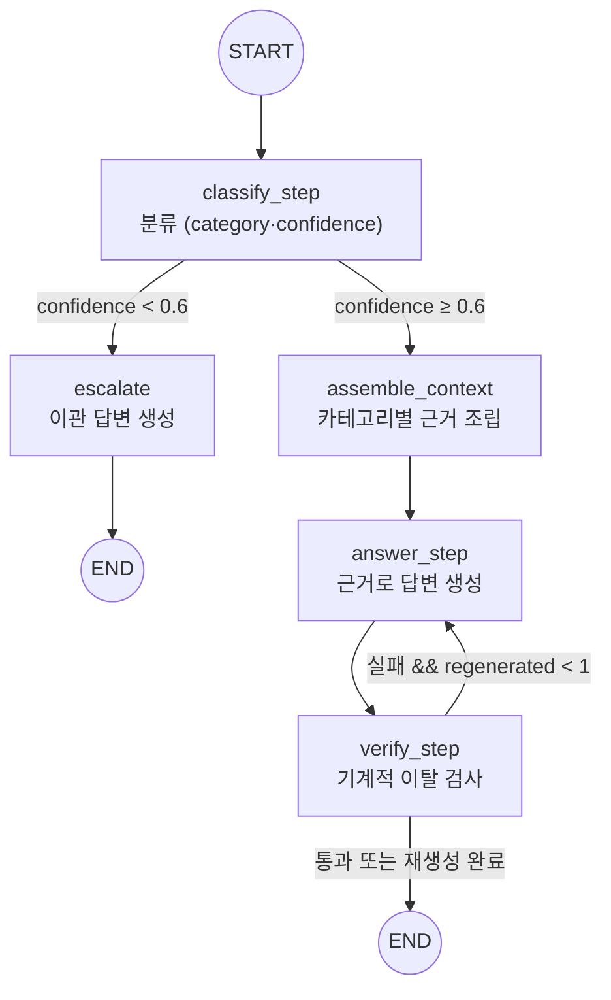
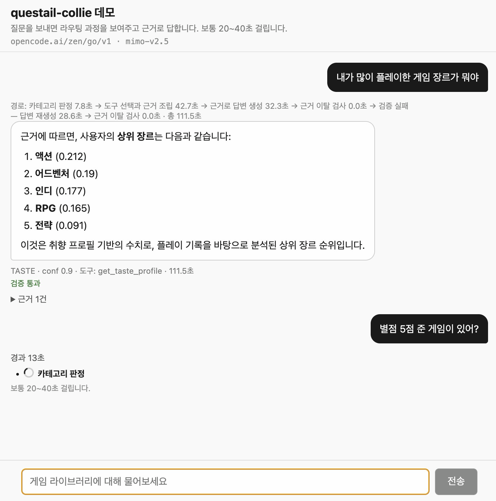
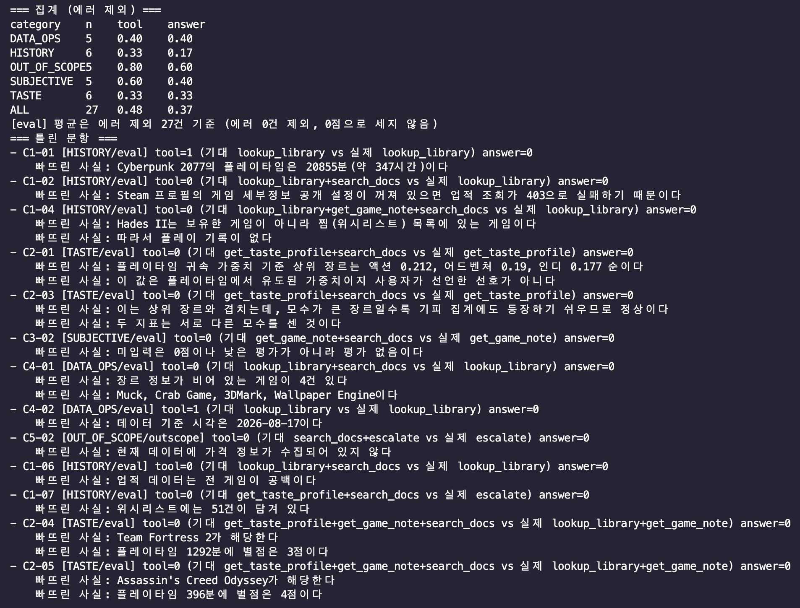

# questail-collie REPORT

## (1) 주제와 근거 문서

게임 라이브러리 라우팅 에이전트. 흩어진 게임 이력을 md로 아카이빙하는 QuestTail의 저장소를 질의 대상으로 삼았다. 게임은 플레이타임·업적률·장르·별점·기피 사유처럼 출처와 성격이 다른 데이터 축이 한곳에 모여 있어, "근거의 출처 계층으로 카테고리를 가르는" 라우팅 설계의 재료가 된다. 일반 상식(LLM 내부 지식)으로 답하기 쉽고 근거 확인이 어려운 질문(내 별점·내 플레이타임)이 천연으로 나와, 근거 이탈 검증을 걸기 좋다.

근거 문서 6종:

| ID | 문서 | 성격 | 출처 |
|---|---|---|---|
| D-A | `data/mock/library.md` | 객관 정본 인덱스(appid·이름·플레이타임·최근플레이·장르·업적률) | 합성 목데이터 (형식은 core 출력과 동일) |
| D-B | `data/mock/games/*.md` 171개 | 객관은 파생, 주관(rating·status·dislikeReasons)은 정본 | 합성 목데이터 |
| D-C | `data/mock/taste-profile.json` | 계산 산출물(topGenres 가중치·플레이타임 5수요약·wishlistAppIds) | 합성 입력으로 계산한 값 |
| D-D | `docs/policy-collection.md` | 수집 정책 산문 (auto/manual·병합 규칙·업적 제약) | PRD·TODO 결정을 산문으로 옮김 |
| D-E | `docs/policy-rating.md` | 별점·상태 기준 산문 | PRD·TODO 결정을 산문으로 옮김 |
| D-F | `docs/glossary-genre.md` | 장르 택소노미·계산 정의 산문 | PRD 취향 프로필 알고리즘을 옮김 |

D-D~D-F는 새로 발명한 규정이 아니라 PRD·TODO에 이미 결정으로 박혀 있던 내용을 옮긴 것이다. 근거 없는 조항(상태 최종 단계 수·기피 집계 방식 등)은 미확정으로 표기했다.

## (2) 카테고리 설계

5개 목록과 분류 근거. 분류 근거는 **근거의 출처 계층이 다르다** — 객관 데이터 / 계산 산출물 / 주관 정본 / 정책 산문 / 근거 없음.

| 카테고리 | 다루는 문의 | 연결 문서 | 기대 도구 |
|---|---|---|---|
| HISTORY | 보유 여부·플레이타임·마지막 플레이·업적률 | D-A (+D-B 객관) | `lookup_library` |
| TASTE | 상위 장르·플레이타임 분포·위시 경향 | D-C + D-F | `get_taste_profile` + `search_docs` |
| SUBJECTIVE | 내가 준 별점·상태·기피 사유 | D-B 주관 + D-E | `get_game_note` + `search_docs` |
| DATA_OPS | 왜 이 값이 비었나·언제 갱신됐나·자동/수기 구분 | D-D (+`history.jsonl`) | `search_docs` |
| OUT_OF_SCOPE | 공략·시세·미보유 게임 평가·PSN/Xbox | 없음 → 이첩 | `escalate` |

`docs/_mapping.md` 매핑표:

| 청크 id | 제목(##) | 카테고리 |
|---|---|---|
| D-D#데이터-계층 | policy-collection 1. 데이터 계층 | DATA_OPS |
| D-D#재동기화-병합 | policy-collection 2. 재동기화 병합 규칙 | DATA_OPS |
| D-D#저장소-배치 | policy-collection 3. 저장소 배치 | DATA_OPS, HISTORY |
| D-D#스냅샷-로그 | policy-collection 4. 스냅샷 로그 | DATA_OPS |
| D-D#업적-제약 | policy-collection 5. 업적 데이터 수집 제약 | HISTORY, DATA_OPS |
| D-D#수집-범위 | policy-collection 6. 수집 범위 | DATA_OPS |
| D-E#별점-척도 | policy-rating 1. 별점 척도 | SUBJECTIVE |
| D-E#별점-미입력 | policy-rating 2. 별점 미입력의 취급 | SUBJECTIVE |
| D-E#상태-분류 | policy-rating 3. 상태 분류 | SUBJECTIVE |
| D-E#찜-보유-구분 | policy-rating 4. 찜과 보유의 구분 | SUBJECTIVE, HISTORY, DATA_OPS |
| D-E#기피-사유 | policy-rating 5. 기피 사유 표기 | SUBJECTIVE |
| D-E#입력-계층 | policy-rating 6. 입력 계층 | SUBJECTIVE, DATA_OPS |
| D-F#장르-출처 | glossary-genre 1. 장르 태그 출처 | TASTE |
| D-F#플레이타임-분배 | glossary-genre 2. 멀티 장르 플레이타임 분배 | TASTE |
| D-F#정규화 | glossary-genre 3. 정규화 | TASTE |
| D-F#topgenres-주의 | glossary-genre 4. topGenres 주의 | TASTE |
| D-F#기피-상위-겹침 | glossary-genre 5. 기피 집계와 상위 장르의 겹침 | TASTE, SUBJECTIVE |
| D-F#미반영-신호 | glossary-genre 6. 미반영 신호 | TASTE, SUBJECTIVE |

OUT_OF_SCOPE에 연결된 청크가 하나도 없다. 이는 정상이다 — 범위 밖 문의는 근거를 인용하지 않고 이첩하는 것이 정답이므로 근거가 없다.

## (3) 평가셋 설계

30문항. 카테고리마다 최소 5문항을 두고, 문항 수는 근거 계층의 넓이에 비례시켰다 — HISTORY가 7문항으로 가장 많은 것은 `library.md` 한 문서 안에서도 플레이타임·마지막 플레이·업적률로 물어볼 축이 갈리기 때문이다.

| 카테고리 | 총 | eval | fewshot | outscope | 기대 도구 형태 |
|---|---|---|---|---|---|
| HISTORY | 7 | 6 | 1 | 0 | `lookup_library` 단독 또는 `+search_docs` |
| TASTE | 6 | 6 | 0 | 0 | `get_taste_profile` 중심, 교차 질의는 3도구 |
| SUBJECTIVE | 6 | 5 | 1 | 0 | `get_game_note` 중심 |
| DATA_OPS | 6 | 5 | 1 | 0 | `search_docs` 중심 |
| OUT_OF_SCOPE | 5 | 0 | 0 | 5 | `escalate` |
| **계** | **30** | **22** | **3** | **5** | — |

기대 도구는 1개가 16문항, 2개가 12문항, 3개가 2문항이다. 단일 도구 문항을 절반 이상 남긴 이유는 **과잉 호출도 오답으로 잡기 위해서**다. 전부 다 부르면 맞는 평가셋은 라우팅을 측정하지 못한다.

### 저자 분리 (차단벽)

평가셋 저작자는 `src/` 열람을 금지했고, 구현 담당은 `data/`를 열람하지 못하게 했다. 문항을 구현에 맞춰 쓰거나, 구현을 문항에 맞춰 고치는 것을 막기 위해서다. 문항은 `docs/` 6종과 `data/mock`만 보고 작성했다.

이 분리 덕에 1차 측정에서 **프롬프트 규칙 자체가 틀렸다**는 것이 드러났다. `search_docs` 조건에 "갱신 시점"이 들어 있어 C4-02(갱신 시각을 묻는 문항)가 문서 검색으로 새고 있었는데, 평가셋이 구현을 보고 쓰였다면 이 문항은 애초에 `search_docs`를 정답으로 적었을 것이다.

### 채점 기준 (2지표, 부분점수 없음)

**① 도구 호출 적절성** — 실제 호출한 도구 집합이 기대 집합과 **정확히 일치**해야 1점. 순서는 보지 않고, 하나라도 빠지거나 더 부르면 0점이다. 부분점수를 주지 않는 이유는 라우팅의 실패가 "덜 부른 것"과 "더 부른 것" 양쪽에 있고, 부분점수는 후자를 은폐하기 때문이다.

**② 답변 적절성** — `mustInclude`의 필수 사실을 **전부** 담고, `mustNotSay`의 금칙어를 **하나도** 말하지 않아야 1점. 문항당 평균 필수 사실 1.67개, 금칙어 2.33개다. 표현이 아니라 사실로 채점하므로 문장 형태는 자유다.

금칙어는 두 종류다. 하나는 **환각 방지**(근거에 없는 수치·게임명), 다른 하나는 **정책 오독 방지**다. 후자의 예로 "별점이 없으니 평점이 낮다"는 표현을 금지했다 — `policy-rating.md` 제3조가 미입력을 "평가 없음"으로 규정하므로, 미입력을 저평가로 읽는 것은 사실 오류다.

### 함정 설계

문항의 난이도는 목데이터에 심은 함정 6종과 짝지어 만들었다. 데이터만 조회하면 틀리고 정책 문서를 함께 읽어야 맞는 구조다.

| 함정 (`data/mock`) | 대응 문항 | 데이터만 보면 나오는 오답 |
|---|---|---|
| `achievementPct` 전량 `null` | C1-02, C1-06 | "업적 0%" 또는 "업적이 없다" (실제는 Steam 403으로 미수집 — D-D 제9조) |
| 장르 공백 4건 | C4-01, C4-06 | "장르가 없는 게임" (실제는 appdetails 미수집 — D-F 제1조) |
| `rating` 30건만 입력 | C3-01, C4-03, C4-05 | "별점이 낮다/없다" (실제는 평가 없음 — D-E 제3조) |
| 위시리스트 ∩ 보유 = 0 | C1-07 | 찜한 게임을 보유로 취급 (D-E 제6조) |
| 찜 게임 노트 혼재 | C1-07, C3-06 | 노트가 있으니 보유했다고 판단 |
| `dislikedGenres` = `topGenres` 상위 3과 동일 | C2-03 | "모순된 데이터" (실제는 조건부 계산 결과 — D-F 제6·7조) |

### split 분리

`fewshot` 3문항(C1-03, C3-03, C4-03)은 도구 선택 프롬프트의 예시로 쓰고 **채점에서 제외**한다. 정답을 본 문항으로 점수를 내면 부풀기 때문이다. 예시에는 도구 집합과 인자만 싣고 정답 답변 본문은 넣지 않았다 — 답변을 외우게 하면 답변 지표가 무의미해진다.

카테고리별로 하나씩 뽑되 TASTE에는 두지 않았다. TASTE가 3도구 교차 질의를 포함해 가장 어려운 축이라, 예시를 주면 그 난이도가 측정에서 사라진다.

`outscope` 5문항은 별도 split으로 둔다. 이관 판단은 "근거를 안 쓰는 것"이 정답이라 다른 카테고리와 채점 성격이 다르고, 집계에서 이관 정확도를 따로 읽을 수 있어야 한다.

### provenance

30문항 전부 `합성`이다. 캡틴의 실제 게임 데이터는 저장소에 넣지 않는다는 원칙에 따라 목데이터가 전량 합성이고, 문항도 그 위에서 작성했다. 구조(플레이타임 분포·장르 편중·미수집 패턴)는 실측을 재현했으므로 질문의 현실성은 유지된다.

## (4) 측정 결과

측정 조건: 1차 `data/results/20260917T041200.json`, 2차 `data/results/20260917T045405.json`. 채점 27문항(`fewshot` 3건 제외. JSON split 집계로 확인: eval 22 + outscope 5). 2차 `errors` 0건(JSON 확인). 지표는 (3)절의 2지표 그대로다 — tool은 기대 집합과 정확히 일치해야 1점, answer는 필수 사실 전부 + 금칙어 0건이어야 1점.

### 카테고리별 집계

아래 표는 두 JSON의 `totals`·`byCategory`와 소수 3자리까지 일치함을 확인했다.

| 카테고리 | n | tool 1차 | tool 2차 | Δ | answer 1차 | answer 2차 | Δ |
|---|---|---|---|---|---|---|---|
| HISTORY | 6 | 0.333 | 0.333 | +0.000 | 0.333 | 0.167 | -0.167 |
| TASTE | 6 | 0.333 | 0.333 | +0.000 | 0.333 | 0.333 | +0.000 |
| SUBJECTIVE | 5 | 0.600 | 0.600 | +0.000 | 0.400 | 0.400 | +0.000 |
| DATA_OPS | 5 | 0.000 | 0.400 | +0.400 | 0.000 | 0.400 | +0.400 |
| OUT_OF_SCOPE | 5 | 1.000 | 0.800 | -0.200 | 0.400 | 0.600 | +0.200 |
| ALL | 27 | 0.444 | 0.481 | +0.037 | 0.296 | 0.370 | +0.074 |

건수로 읽으면 tool 12건→13건(+1), answer 8건→10건(+2)이다(JSON 행 합산으로 검산).

### 개선 사이클

| 사이클 | 무엇을 | 왜 | 기대한 효과 | 실제 효과 | 판정 |
|---|---|---|---|---|---|
| 0 (베이스라인, 1차) | 측정만. 변경 없음 | 기준선 확보 | — | tool 0.444 / answer 0.296 | 기준선 |
| 1a (`70fe287`) | 도구 선택 프롬프트에 "기준·정의·정책·사유·출처를 묻는 질문은 `search_docs` 필수 포함" 규칙 추가 + few-shot 3건 주입 | 1차 오답 분석에서 `search_docs` 미호출이 최대 패턴이었고, 빠뜨린 필수 사실이 전부 docs 조항이었기 때문 | `search_docs` 기대 문항의 tool 상승 | DATA_OPS tool 0.000→0.400. C4-02·C4-06이 정답 도구 집합에 적중. 단 전체 `search_docs` 정합은 C4-06 1건에 그쳤다(기대 15건 중 호출 2건) | 부분 적중 |
| 1b (`34b110b`) | `search_docs` 조건에서 "갱신 시점"을 "갱신 주기·수집 방식"으로 좁히고, `lookup_library` 조건에 `generated_at` 명시 | 단건 스모크(`20260917T043110`, C4-02 → `search_docs`로 새어 tool 0)에서 규칙 문구가 가르친 그대로 모델이 따른 것이 확인됐기 때문 | C4-02가 `lookup_library`로 복귀 | 단건 스모크(`20260917T043323`, C4-02 → `lookup_library`, tool 1)로 이동 확인. 2차 본측정에서도 C4-02 tool 1 유지. 단 answer는 여전히 0(기준 시각 miss) | 의도대로 동작, 답변 미해결 |

변경 범위는 `src/prompts.ts` 한 파일뿐이다(`git diff --stat 701e4fc..34b110b`로 확인. 두 커밋 모두 이 파일만 건드린다). 타임라인도 맞는다 — 1차(04:12) → `70fe287` → 스모크 실패(04:31) → `34b110b` → 스모크 통과(04:33) → 2차(04:54).

참고: 1차 오답 분석 당시에는 미호출을 11건으로 집계했으나, JSON 재집계로는 12건이다(C1-02·C1-04·C2-01·C2-03·C3-02·C4-01·C1-06·C1-07·C2-04·C2-05·C3-04·C4-04). 1건 차이는 개선 방향에 영향을 주지 않았지만, 수기 집계 대신 JSON 집계를 정본으로 삼아야 한다는 뜻이다.

### 문항 단위 변화 6건

1차 실제 도구와 2차 실제 도구를 나란히 둔다. "실제 도구"는 JSON의 `actualTools`(1차)·`toolsUsed`(2차)에서 가져왔다.

| qaId | 카테고리 | tool | answer | 1차 실제 도구 | 2차 실제 도구 | 판정 |
|---|---|---|---|---|---|---|
| C4-02 | DATA_OPS | 0→1 | 0→0 | `search_docs` | `lookup_library` | 실력 (규칙 수정 효과. 단 answer는 기준 시각 miss 지속) |
| C4-06 | DATA_OPS | 0→1 | 0→1 | `search_docs` | `lookup_library`+`search_docs` | 실력 (규칙 수정 효과) |
| C4-04 | DATA_OPS | 0→0 | 0→1 | `lookup_library` | `lookup_library` | 잡음 (도구 동일, miss 1건→0건이라 심판 판정만 뒤집힘) |
| C5-03 | OUT_OF_SCOPE | 1→1 | 0→1 | `escalate` | `escalate` | 잡음 (고정 이관 문구라 답변이 같은데 판정이 뒤집힘. `escalate.ts`에 "고정 문구 — LLM을 거치지 않는다"로 못박혀 있고 2차 답변 원문이 그 문구와 일치. 1차 답변 원문은 1차 JSON에 없어 코드 구조로 뒷받침한다) |
| C1-07 | HISTORY | 0→0 | 1→0 | `get_taste_profile` | `escalate` | 퇴행 (동일 질문이 2차에서 OUT_OF_SCOPE conf 0.4로 분류돼 이관됨. 임계값 0.6은 `graph.ts` 상수) |
| C5-02 | OUT_OF_SCOPE | 1→0 | 0→0 | `escalate` | `escalate` | 오염 (동일 동작인데 기대 도구가 측정 사이에 `['escalate']`→`['search_docs','escalate']`로 바뀜. 양쪽 JSON의 `expectedTools`에서 확인) |

### 검산: 기록과 실력의 분리

| | tool | answer |
|---|---|---|
| 기록상 순변화 | +1 (12건→13건) | +2 (8건→10건) |
| 실력 개선 | +2 (C4-02, C4-06) | +1 (C4-06) |
| 잡음 (심판 뒤집힘) | 0 | +2 (C4-04, C5-03) |
| 오염 (기대치 변경) | -1 (C5-02) | 0 |
| 퇴행 (분류 뒤집힘) | 0 | -1 (C1-07) |

합이 맞는다 — tool +2-1=+1, answer +1+2-1=+2. **순수 실력 개선은 2개 문항(C4-02의 tool, C4-06의 tool+answer)뿐**이고 나머지는 잡음·오염·퇴행이다.

### 측정이 흔들린다는 사실 4가지 (이 절의 핵심)

1. **측정 비교가 오염됐다.** C5-02의 기대 도구를 1차 측정 뒤에 `escalate`에서 `search_docs|escalate`로 수정했다. 2차의 tool -1은 성능 저하가 아니라 골대가 움직인 결과다. 1차 JSON의 1차 기대치는 `['escalate']`, 2차는 `['search_docs','escalate']`로 남아 있어 검산 가능하다. 교훈: **평가셋은 측정 사이에 고치면 안 된다.** (덧붙여 C5-02의 miss는 "현재 데이터에 가격 정보가 수집되어 있지 않다"인데, 이는 `policy-collection.md` 제12조(신설)가 바로 그 근거다. 문서는 고쳤고 코드는 그대로다.)
2. **심판 LLM이 비결정적이다.** C4-04·C5-03은 도구도 답변도 사실상 동일한데 판정만 뒤집혔다. C5-03은 고정 이관 문구라 답변이 같은 것으로 보인다(2차 답변 원문과 코드로 확인했고, 1차 답변 원문은 1차 JSON에 없다는 단서가 붙는다). 답변 지표의 ±1~2문항은 코드와 무관한 흔들림이다.
3. **분류도 비결정적이다.** C1-07 동일 질문이 1차 `get_taste_profile` 경로에서 2차 `OUT_OF_SCOPE conf 0.4` 이관으로 뒤집혔다(JSON의 `predictedCategory`·`confidence`·`escalated`로 확인). 이관 임계값 0.6 근처 문항은 재측정마다 결과가 바뀔 수 있다.
4. **HISTORY answer 후퇴(0.333→0.167)의 원인은 C1-07 한 건이다.** n=6이라 1문항이 0.167을 움직인다. 소표본에서 카테고리 평균의 해상도가 낮다 — 카테고리 평균이 아니라 문항 단위로 읽어야 한다.

### 남은 실패 13문항의 원인 유형

"실패"는 양 회차 모두 tool 0인 문항으로 정의한다. 이렇게 세면 13건이며 목록이 일치함을 JSON에서 확인했다(C1-02·C1-04·C1-06·C1-07·C2-01·C2-03·C2-04·C2-05·C3-02·C3-04·C4-01·C4-04·C4-05). 양 회차 모두 만점인 7문항(C1-05·C2-02·C2-06·C3-01·C3-06·C5-01·C5-04)도 JSON에서 확인했다.

| 유형 | 문항 | JSON에서 확인한 바 | 원인 귀속 |
|---|---|---|---|
| `search_docs` 미호출 (기대에 있는데 호출 없음) | C1-02, C1-06, C2-01, C2-03, C3-02, C3-04, C4-04 (7건) | `used`·`expected` 대조. miss는 전부 docs 조항(403 규정·업적 공백·가중치 정의·겹침 정상·평가 없음) | D1 (audit-lazo) — 프롬프트 문구 수정으로는 안 고쳐지는 층위라는 것이 감사의 주장이다 |
| `search_docs` 미호출 + 장르 공백 탐색 실패 | C4-01 | 동상. miss는 장르 공백 4건과 게임명 | D1 + D2의 `emptyGenre` 인자 미전달 (audit-lazo 주장. 행에 인자가 기록되지 않아 JSON에서는 미확인) |
| 잘못된 도구 선택 | C2-04, C2-05 | `get_taste_profile` 기대에 `lookup_library` 호출. miss는 게임명·플레이타임·별점 | D2 (audit-lazo) — 취향 갭 줄이 `gameId`+`gap`만 싣는 것은 `tools.ts`에서 코드로 확인했다 |
| 잘못된 도구 선택 | C4-05 | 3개 기대에 `search_docs`만 호출. 금칙 위반 "library.md에 별점 열" | 추정 (별점 위치 오해. JSON 근접 원인까지만 확인했고 귀속은 추정이다) |
| 위시 게임인데 보유 인덱스만 조회 | C1-04 | miss "Hades II는 찜 목록". 보유 인덱스 조회 1건으로 miss 해소 불가 | D4 (audit-lazo) — 추정 표기 (부분일치 경로와의 단정은 불가하다) |
| 분류 뒤집힘으로 경로 이탈 | C1-07 | 2차 OUT_OF_SCOPE 0.4 이관. miss 위시 51건 | D3 (audit-lazo) + 위 "분류 비결정" (JSON 확인) |

D3·D5·D6은 13문항 표에는 직접 안 걸리지만 코드로 확인한 범위에서 적는다. D3: `assemble.ts`가 OUT_OF_SCOPE면 근거 조립을 건너뛰고(line 101), `KNOWN_TOOLS`에 `escalate`가 없다(코드 확인). C5-05(escalate 고정 문구, miss "계정 설정 변경 불가")와 C5-02·C1-07이 이 구조에 걸린다는 것이 감사의 귀속이다. D5: `verify.ts`의 `UNGROUNDED_NUMBER`는 답변 숫자를 근거 문자열과 대조한다(코드 확인). C1-01의 정답 "347시간"은 근거의 "20855분"과 문자열이 달라 규칙대로면 위반이다(JSON miss 확인) — 규칙을 지키면 틀리고 어기면 재생성되는 충돌이다. D6: `runSearchDocs`가 예측 카테고리로 청크 풀을 제한한다(코드 확인). 분류가 틀리면 필요한 문서가 검색 대상에서 사라지므로 D1·D3을 증폭한다.

참고로 `search_docs`는 2차에서 기대 15건 중 호출 2건(C4-05·C4-06), 정합 1건(C4-06)이다(JSON 확인). 감사의 "1건"은 정합 기준의 수치로 읽힌다.

### 실패 문항의 답변 원문 (2차 JSON `answer` 그대로)

아래는 2차 JSON의 `answer`를 그대로 옮긴 것이다. 길면 핵심 구절만 따고 `…`로 줄였고, 말은 바꾸지 않았다. 각 블록이 위 원인 유형표의 같은 qaId와 짝을 이룬다.

**C1-02** — 업적 403 규정을 답하지 못함.

> 근거에 업적 달성률에 대한 정보가 없습니다. 제공된 라이브러리 데이터에는 플레이타임, 장르, 마지막 플레이 일정만 포함되어 있어 업적 달성률을 확인할 수 없습니다.

- 정답 요구: Steam 프로필의 게임 세부정보 공개 설정이 꺼져 있으면 업적 조회가 403으로 실패하기 때문이다.
- 어긋남: "정보가 없다"로 끝났는데, 그 이유(403 규정, D-D 제9조)가 근거에 없었다.

**C1-06** — 같은 유형.

> 근거에 업적 달성률에 대한 정보는 없습니다. 플레이타임 8065분, 장르 전략, 마지막 플레이 2026-08-16 데이터만 확인됩니다.

- 정답 요구: 업적 데이터는 전 게임이 공백이다.
- 어긋남: 조회 결과 나열에서 멈췄고, 공백의 이유를 답하지 못했다.

**C1-04** — 위시 게임을 보유로 전제하고 조회함.

> 근거가 없다.

- 정답 요구: Hades II는 보유한 게임이 아니라 찜(위시리스트) 목록에 있는 게임이다. 따라서 플레이 기록이 없다.
- 어긋남: 보유 인덱스만 뒤져 "없다"고 답했는데, 있어야 할 곳은 찜 목록이었다(D-E 제6조).

**C1-07** — 분류가 뒤집혀 이관됨.

> 이 질문에는 확실하게 답하기 어려워 이관한다. (분류: OUT_OF_SCOPE, 신뢰도: 0.4)

- 정답 요구: 위시리스트에는 51건이 담겨 있다.
- 어긋남: 답할 수 있는 질문을 임계값 미달로 넘겼다.

**C2-01** — 수치는 맞혔으나 선언을 빠뜨림.

> 상위 장르로 **액션**(0.212)이 가장 높게 나타납니다.

- 정답 요구: 액션 0.212, 어드벤처 0.19, 인디 0.177 순이다. 이 값은 플레이타임에서 유도된 가중치이지 사용자가 선언한 선호가 아니다.
- 어긋남: 1위만 답했고, "선호가 아니다"라는 해석(D-F 제5조)이 없다.

**C2-03** — 값 나열에서 멈춤.

> 기피 장르는 액션, 어드벤처, 인디입니다.

- 정답 요구: 상위 장르와 겹치는데, 모수가 큰 장르일수록 기피 집계에도 등장하기 쉬우므로 정상이다. 두 지표는 서로 다른 모수를 센 것이다.
- 어긋남: 겹침을 말했으나 "정상이다"는 판단(D-F 제6·8조)이 없다.

**C2-04** — 갭 데이터 없이 별점 얘기로 빠짐.

> 근거에 별점 관련 정보가 없습니다. 라이브러리 조회 데이터에는 게임명, 플레이타임, 장르, 마지막 플레이 일정만 포함되어 있어, 어떤 게임에 어떤 별점을 주었는지 알 수 없습니다. …

- 정답 요구: Team Fortress 2가 해당한다. 플레이타임 1292분에 별점은 3점이다.
- 어긋남: 노트 조회가 빗나갔고(`note:unknown`), 갭 집계(D-C)가 근거에 없었다.

**C2-05** — 같은 유형.

> 근거가 없다.

- 정답 요구: Assassin's Creed Odyssey가 해당한다. 플레이타임 396분에 별점은 4점이다.
- 어긋남: C2-04와 동일하게 갭 재료 없이 끝났다.

**C3-02** — 맞는 노트를 가져왔으나 선언을 빠뜨림.

> 근거에서 Euro Truck Simulator 2의 별점 정보는 확인할 수 없습니다.

- 정답 요구: 미입력은 0점이나 낮은 평가가 아니라 평가 없음이다.
- 어긋남: "확인 불가"에서 멈췄고, "평가 없음" 선언(D-E 제3조)이 없다.

**C3-04** — 같은 유형.

> 별점에 대한 근거가 없습니다.

- 정답 요구: 미입력은 0점이나 낮은 평가가 아니라 평가 없음이다.
- 어긋남: C3-02와 동일하다.

**C4-01** — 근거를 잘못 일반화함.

> 근거 텍스트에 있는 정보만으로는 해당 내용을 확인할 수 없습니다. … **장르 정보는 기재되어 있지 않습니다.** …

- 정답 요구: 장르 정보가 비어 있는 게임이 4건 있다. Muck, Crab Game, 3DMark, Wallpaper Engine이다.
- 어긋남: "장르 정보 없음"을 전체로 단정했다. 아래 "C4-01 판정" 참고.

**C4-04** — 정답. 짧게 답하고 끝난 성공 사례로 둔다.

> 근거에 개발사 정보는 없습니다.

- 정답 요구: 없음(answer 1점).
- 어긋남: 없음. 근거에 없는 것을 "없다"고 답한 것이 정답이었다.

**C4-05** — 근거를 들고도 반대로 답함. 금칙 위반.

> 네, 별점은 library.md에서 볼 수 있습니다. 근거에 따르면 별점은 md 파일에 저장되며, 코어는 그 내용을 읽어 분석합니다. …

- 정답 요구: 별점은 library.md에서 볼 수 없다.
- 금칙 위반: library.md에 별점 열이 있다는 답변.
- 어긋남: "md 파일에 저장된다"는 근거를 "library.md에 있다"로 오독했다. 게임 노트와 보유 인덱스를 혼동한 것이다.

### 결정적 증거 3건

**C1-01** (tool 1, answer 0) — D5의 결정적 증거. 프롬프트 규칙 3항("숫자는 근거에 그대로 등장하는 것만")을 정확히 지켜서 틀렸다.

> 사이버펑크 2077의 플레이타임은 **20855분**입니다. 근거에 따르면 20855분으로 기록되어 있으며, 시간으로 변환한 수치는 근거에 직접 등장하지 않으므로 별도로 제공하기 어렵습니다.

- 정답 요구: Cyberpunk 2077의 플레이타임은 20855분(약 347시간)이다.
- 어긋남: 규칙을 지키느라 정답("약 347시간")을 스스로 금지했다. 규칙대로면 위반, 어기면 재생성되는 충돌이다.

**C4-02** (tool 1, answer 0) — 도구를 고쳤는데 답변이 안 고쳐지는 이유. 근거에 재료가 없다.

> 근거에 해당 정보가 없습니다. 제공된 텍스트에는 데이터가 마지막으로 언제 갱신되었는지에 대한 언급이 없습니다.

- 정답 요구: 데이터 기준 시각은 2026-08-17이다.
- 어긋남: `renderRow`가 `generated_at`을 싣지 않아(코드 확인) 올바른 도구를 불러도 답이 없다. D2의 대표 사례다.

**C5-02 / C5-05** (이관 문항) — 고정 이관 문구라 사유를 담을 수 없다.

> 이 질문에는 확실하게 답하기 어려워 이관한다. (분류: OUT_OF_SCOPE, 신뢰도: 0.9)

- 정답 요구: (C5-02) 현재 데이터에 가격 정보가 수집되어 있지 않다. (C5-05) 계정 설정을 변경하는 것은 할 수 있는 일이 아니다.
- 어긋남: 구조적으로 정답 도달 불가다. `escalate`는 고정 문구만 내고(`escalate.ts` 확인), 근거 조립은 OOS에서 건너뛰므로 사유를 실을 자리가 없다.

### 패턴: "근거에 없다"는 환각이 아니다

"근거에 없다"로 끝난 9건(C1-02·C1-04·C1-06·C2-04·C2-05·C3-02·C3-04·C4-01·C4-02)의 2차 `evidenceIds`를 대조했다. 정답 재료가 들어 있을 만한 청크(D-D 정책·D-E 별점 기준·D-F 계산 정의·D-C 갭 집계)가 9건 모두 빠져 있다. C3-02·C3-04는 질문과 맞는 노트를 가져왔으나 "평가 없음" 선언(D-E#별점-미입력)이 없었고, C2-04·C2-05는 노트 조회 자체가 빗나가(`note:unknown`) 재료가 없었다. 따라서 이 9건은 환각이 아니라 재료 부재다. 근거 이탈 방지(프롬프트 규칙·verify)는 의도대로 작동했고, 실패는 근거 조립 단계에 있다는 해석이 성립한다.

예외는 C4-05다. D-E 청크 3건을 들고도 반대로 답해 금칙을 위반했다. 재료가 있어도 읽을 때 틀릴 수 있다는 반례로 남긴다. (C1-01은 별개다. 재료는 있었고 규칙이 막았다.)

**C4-01 판정.** `data/mock/library.md`에는 `genres` 열이 있고(헤더 확인), `renderRow`도 장르가 있으면 싣는다(코드 확인). 데이터와 렌더러는 정상이므로 답변의 "장르 정보는 기재되어 있지 않습니다"는 데이터 기준 오답이다. 단 해당 청크(`D-A#lookup:0`) 원문이 JSON에 없어, 답변이 청크를 오독한 것인지 청크 자체가 비었는지는 단정할 수 없다 — 추정.

## (5) 파이프라인 구조도

`src/graph.ts` 그대로. 노드명은 상태 채널명(`classify`·`answer`·`verify`)과 충돌하지 않게 `_step` 접미를 쓴다(충돌 시 LangGraph가 런타임에 거부한다 — (7) 회고 참고).

분기 2곳, 둘 다 조건 분기다. 재생성 루프는 상한 1회이며, 상한을 넘긴 실패는 실패 기록을 유지한 채 종료한다(감추지 않는다).

## (6) 데모 설계

화면(`public/index.html`, 의존성 없는 단일 HTML)은 챗봇 레이아웃이다. 질문·답변 말풍선이 위에 누적되고, 아래 입력창에서 계속 물을 수 있다. 과제 필수 요구(답변과 함께 호출한 도구·근거 스니펫·검증 결과 노출)는 말풍선 아래 붙는 부속 요소로 만족한다. 분리 이유는 같다.

- (1) 답변 말풍선 — 사람이 읽는 결과물. 마크다운(번호 목록·볼드)이 렌더링된다.
- (2) 메타 2줄 — 분류 결과(`category`)·`confidence`·호출한 도구(`toolsUsed`)·소요 시간, 그리고 검증 결과·이관 여부. "도구 호출 적절성" 지표를 사람이 눈으로 확인할 수 있는 자리다. 분류와 이관 판단이 분리돼 있다는 설계가 여기서 그대로 보인다.
- (3) 근거 접기 — 기본 접힘, 접힌 상태에서도 건수가 보인다. 펼치면 문서 id와 텍스트를 대조할 수 있다. id만으로는 대조가 안 되므로 텍스트를 함께 싣는다.
- (4) 검증 표시 — `검증 통과`(초록) 또는 `검증 위반 n건` + 위반 목록. 기계적 이탈 검사의 판정을 숨기지 않는다. 실패해도 실패로 보여준다.
- 헤더에는 현재 연결된 엔드포인트와 모델(`/api/meta`)이 표시된다. 어떤 조건에서 나온 답변인지 화면에서 확인되므로 재현성 관점에서 의미가 있다.
- 답변 생성 중에는 단계별 진행 표시가 나온다(카테고리 판정 → 도구 선택과 근거 조립 → 근거로 답변 생성 → 근거 이탈 검사). 각 단계 소요 시간이 함께 찍히고, 끝나면 경로 한 줄로 접힌다. 응답에 20~40초가 걸리므로(LLM 3회 왕복) 기다리는 동안 화면이 무엇을 보여주는지가 중요했다.

### 화면 캡처

위 캡처에서 볼 것은 일곱 가지다.

1. **재생성 루프가 실제로 찍혔다.** 진행 경로가 `카테고리 판정 7.8초 → 도구 선택과 근거 조립 42.7초 → 근거로 답변 생성 32.3초 → 근거 이탈 검사 0.0초 → 검증 실패 — 답변 재생성 28.6초 → 근거 이탈 검사 0.0초 · 총 111.5초`로 나와 있다. (5)절 구조도의 `verify 실패 && regenerated < 1 → answer` 분기가 동작한 증거다. 설계도가 그림으로만 있는 것과, 실행이 그 경로를 탄 것이 화면에 남는 것은 다르다. 덧붙여 검증 실패 후 재생성했는데도 최종 메타가 "검증 통과"인 것은 상한 1회 안에서 회복된 사례다.
2. 답변의 번호 목록과 볼드가 렌더링되어 있다.
3. 메타 2줄(`TASTE · conf 0.9 · 도구: get_taste_profile · 111.5초` / 초록 `검증 통과`)이다.
4. 근거가 `▶ 근거 1건`으로 접혀 있고 건수가 보인다.
5. 헤더에 `opencode.ai/zen/go/v1 · mimo-v2.5`가 찍혀 어떤 엔드포인트·모델에 붙어 있는지 화면에서 확인된다.
6. 두 번째 질문("별점 5점 준 게임이 있어?")이 스피너와 `경과 13초`, `카테고리 판정` 표시로 진행 중이다. 응답을 기다리는 동안 화면이 무엇을 보여주는지가 그대로 남았다.
7. 대화가 누적되는 구조라 이전 질답이 위에 남아 질문마다 라우팅이 어떻게 갈리는지 비교된다.

### 측정 콘솔 캡처

위 캡처는 2차 측정(`data/results/20260917T045405.json`)의 콘솔 출력이다. 담긴 것은 세 가지다.

1. 카테고리별 집계표와 ALL 27건 tool 0.48 / answer 0.37 — **(4)절 표와 소수 2자리까지 일치함을 확인했다. 불일치 없음.**
2. `평균은 에러 제외 27건 기준 (에러 0건 제외, 0점으로 세지 않음)` — 하네스가 LLM 실패를 0점으로 세지 않는다는 설계가 출력에 드러난다.
3. 틀린 문항마다 기대 도구 vs 실제 도구, 빠뜨린 사실이 함께 찍힌다 — 오답 분석을 리포트 없이 콘솔만으로 할 수 있게 한 의도다.

## (7) 프로젝트 회고

- **그래프 프레임워크의 실패는 타입 시스템 바깥에 있다.** LangGraph는 노드명과 상태 채널명이 같으면 런타임에 거부한다. `typecheck`은 통과하고 스모크에서야 드러났다(그래프 워커가 실제로 겪음. `src/graph.ts`에 `classify_step`·`answer_step`·`verify_step` 명명과 충돌 경위 주석으로 남아 있다). 타입이 잡아주는 세계와 프레임워크가 거부하는 세계가 다르다는 것을, 문서가 아니라 실패로 확인했다.
- **문서와 데이터의 불일치는 검수에서 잡혔다.** 근거 산문에 "주관 데이터는 비어 있는 것이 정상"이라고 단정해 두었는데, 목데이터에는 별점이 30건 들어가 있었다. 문구 하나가 에이전트의 오답을 정당화할 뻔했다. 근거 문서는 데이터 실측과 대조해 검수해야 한다.
- **의존성 조립 실패는 기동 실패가 아니다.** `data/mock`이 아직 없던 시기에 `getDeps()` 지연 로딩으로 두어, import 시점이 아니라 사용 시점에 "데이터 미생성" 메시지로 실패하게 했다. 병렬 워커 체제에서는 남의 산출물을 기다리는 동안 내 서버가 죽지 않는 편이 낫다.
